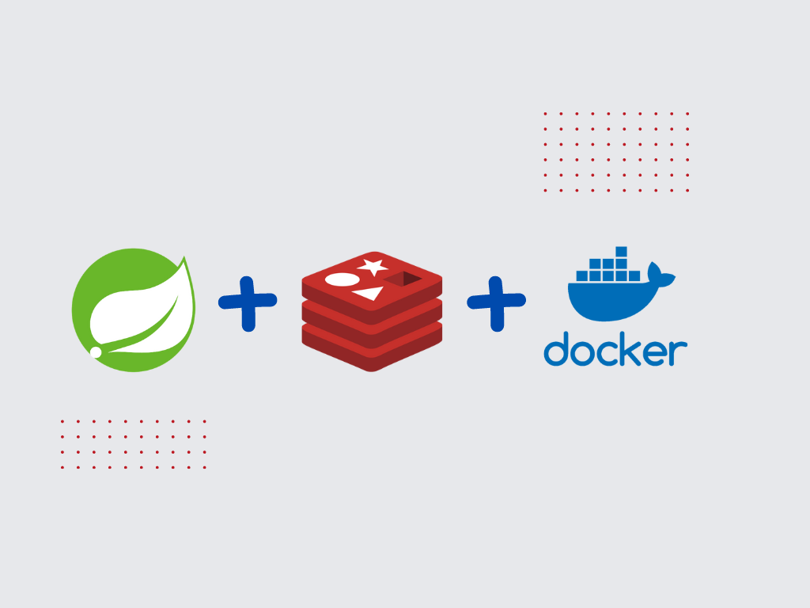
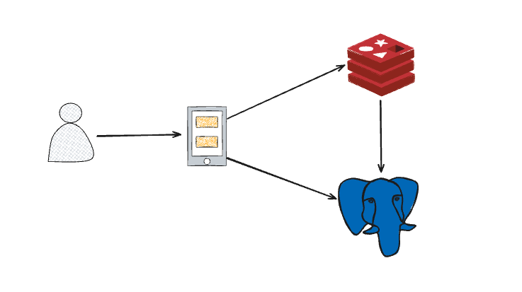
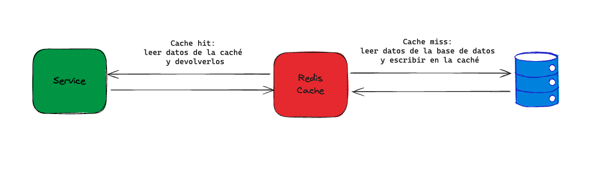

## Uso de Spring Cache con Redis
Mejora el rendimiento de tu aplicación utilizando Spring Cache con Redis:

- Uso de Spring Cache.
- Integración de spring cache con redis.
- Creación de Servidor redis con docker.
- Programar tareas calendariazadas con spring  



Se desea adicionar un cache con redis para todos los libros, el cual deberá ser limpiado todos los días a las 12:AM. Se debe crear una clave para caache con el nombre users.



### **Implementación de caché en Spring Boot con Redis**

Implementar caché en una aplicación de Spring Boot usando Redis 

En el entorno digital acelerado de hoy en día, donde la velocidad de la aplicación es crucial para mejorar la experiencia del usuario, el caché se convierte en un método potente para aumentar sustancialmente el rendimiento de la aplicación.

En este taller, profundizaremos en el mundo del caché y exploraremos cómo implementar el caché de Redis en una aplicación de Spring Boot, desbloqueando su máximo potencial para producir ventajas de rendimiento significativas.

### **Proveedores de caché de Spring Boot**
Los proveedores de caché nos permiten configurar el caché en la aplicación de manera transparente y clara. Utiliza los siguientes pasos para configurar cualquier proveedor de caché dado:

- Añadir la anotación @EnableCaching al archivo de configuración.
- Agregar la biblioteca de caché requerida al classpath.
- Agregar el archivo de configuración del proveedor de caché al classpath raíz.

Los siguientes son los proveedores de caché soportados por el framework de Spring Boot:

- JCache
- EhCache
- Hazelcast
- Infinispan
- Couchbase
- **Redis**
- Caffeine
- Simple

Redis es una base de datos NoSQL, por lo que no tiene tablas, filas o columnas. Además, no permite declaraciones como select, insert, update o delete. En su lugar, Redis utiliza estructuras de datos para almacenar datos. Como resultado, puede servir elementos solicitados con frecuencia en tiempos de respuesta de submilisegundos y permitir un escalado fácil para cargas de trabajo más grandes sin aumentar el costo de un sistema back-end más caro.
Redis también puede usarse con soluciones de transmisión para consumir, procesar y analizar datos en tiempo real con latencia de submilisegundos. Por lo tanto, abogamos por implementar el caché en Spring Boot usando Redis.

### **¿Qué es Redis?**

Remote Dictionary Server, también conocido como Redis, es un almacén de datos en memoria y una de las muchas opciones para implementar caché en aplicaciones de Spring Boot debido a su velocidad, versatilidad y simplicidad de uso. Es un almacén de clave-valor versátil que soporta varias estructuras de datos, como Strings, Sorted Sets, Hashes, Lists, Streams, Bitmaps, Sets, etc., ya que es una base de datos NoSQL y no necesita un esquema predeterminado.

Redis puede usarse de varias maneras, incluyendo:

1. **Base de Datos en Memoria:** En el mundo actual impulsado por los datos, manejar grandes cantidades de datos en tiempo real es un desafío común para las empresas. Una base de datos en tiempo real es un tipo de repositorio de datos diseñado para adquirir, analizar y/o aumentar una corriente entrante de puntos de datos en tiempo real, a menudo inmediatamente después de que se producen los datos. Redis puede usarse para construir infraestructura de datos para aplicaciones en tiempo real que necesitan alto rendimiento y baja latencia.
2. **Caché:** Muchas aplicaciones luchan con la necesidad de almacenar y recuperar datos rápidamente, especialmente en sistemas con alta latencia. Debido a su velocidad, Redis es la opción ideal para el almacenamiento en caché de llamadas a API, estados de sesión, cálculos complejos y consultas a bases de datos.
3. **Intermediario de Mensajes (MQ):** Siempre ha sido difícil transmitir datos dentro de la organización y hacerlos accesibles para varios componentes del sistema. Redis soporta mensajería, fuentes de eventos, alertas y recepción de datos a alta velocidad utilizando su tipo de datos de stream.

### **¿Cómo funciona el caché de Redis?**

El caché de Redis almacena eficazmente los resultados de las operaciones de recuperación de bases de datos, permitiendo que las solicitudes posteriores recuperen los datos directamente del caché. Esto mejora significativamente el rendimiento de la aplicación al reducir las llamadas innecesarias a la base de datos.



Cómo funciona el caché Cuando se realiza una solicitud, el servicio inicialmente busca en el caché de Redis los datos deseados. Cuando ocurre un acierto de caché, los datos se recuperan rápidamente del caché y se proporcionan de inmediato al servicio, evitando la necesidad de interactuar con la base de datos.

Sin embargo, si los datos solicitados no se encuentran en el caché (falta de caché), el servicio recurre inteligentemente a la base de datos para recuperar la información requerida. Posteriormente, los datos recuperados se almacenan en el caché de Redis, permitiendo que las futuras solicitudes de los mismos datos se sirvan directamente desde el caché, eliminando así más consultas a la base de datos y acelerando los tiempos de respuesta en general.

Redis también puede usarse para tareas de eliminación y actualización, garantizando datos consistentes y actualizados en el caché y mejorando aún más la eficiencia general.

## **Configuración de Redis en un Proyecto Spring Boot**

### **1. Configurar Redis en Docker**

Archivo `dev-stack.yml`

- Este archivo de Docker Compose configura un contenedor de Redis para el entorno de desarrollo.

```yaml title="dev-stack.yaml" linenums="1"
  cache-db:
    image: redis:6.2-alpine
    container_name: best_book_cache
    restart: always
    ports:
      - "6379:6379"
    command: redis-server --loglevel warning --requirepass jconfdominicana
```

- **image**: redis:6.2-alpine: Utiliza la imagen `redis` versión `6.2-alpine`.
- **container_name: `best_book_cach`**: Nombre del contenedor.
- **restart: `always`**: Configura el contenedor para que se reinicie automáticamente.
- **ports: `"6379:6379"`**: Mapea el puerto `6379` del host al puerto `6379` del contenedor.
- **command: `redis-server --loglevel warning --requirepass jconfdominicana`**: Inicia Redis con un nivel de log `warning` y una contraseña `jconfdominicana`.


### **2. Configurar Redis en Spring Boot**

Archivo `application.properties`

- Configura la conexión a Redis en el archivo de propiedades.

```properties title="application.properties" linenums="1"
####### Redis Configuration ########
cache.redis.address=redis://127.0.0.1:6379
cache.redis.password=jconfdominicana
```

- **`cache.redis.address=redis://127.0.0.1:6379`**: Dirección del servidor Redis.
- **`cache.redis.password=jconfdominicana`**: Contraseña para acceder a Redis.

### **3. Configuración de Propiedades**

Clase `PropertiesConfig.java`

Esta clase carga las propiedades de configuración.

```java title="PropertiesConfig.java" linenums="1"
@Configuration
@PropertySource(value="classpath:application.properties")
public class PropertiesConfig {

}
```

- **`@Configuration`**: Indica que esta clase tiene una o más definiciones de métodos `@Bean`.
- **`@PropertySource(value="classpath:application.properties")`**: Carga el archivo `application.properties`.

### **4. Dependencias en `pom.xml`**

Adicionar las dependencias necesarias para Redis.

```xml
<dependency>
   <groupId>org.springframework.boot</groupId>
   <artifactId>spring-boot-starter-cache</artifactId>
</dependency>
<dependency>
   <groupId>org.redisson</groupId>
   <artifactId>redisson</artifactId>
   <version>3.18.1</version>
</dependency>
```

- **`spring-boot-starter-cache`**: Proporciona soporte para la anotación de caché de Spring.
- **`redisson`**: Cliente Redis avanzado para Java.

### **5. Clase de Constantes**

Clase `CacheConstants.java`

Define constantes utilizadas en la configuración de caché.

```java title="CacheConstants.java" linenums="1"
public class CacheConstants {
    public static final String USER_CACHE_NAME = "users";
    public static final String SCHEDULED_RESET_CACHE = "0 0 0 * * ?";
}
```

- **`USER_CACHE_NAME`**: Nombre del caché para usuarios.
- **`SCHEDULED_RESET_CACHE`**: Cron para reiniciar el caché diariamente.

- **Link**: [Redis Calendario](https://crontab.cronhub.io/)

### **6. Configuración de Redis**

Clase `RedisConfig.java`

La clase `RedisConfig` se encarga de configurar el cliente Redis y el gestor de caché en una aplicación Spring Boot.

   
```java title="RedisConfig.java" linenums="1"
import lombok.extern.slf4j.Slf4j;
import org.redisson.Redisson;
import org.redisson.api.RedissonClient;
import org.redisson.config.Config;
import org.redisson.spring.cache.CacheConfig;
import org.redisson.spring.cache.RedissonSpringCacheManager;
import org.springframework.beans.factory.annotation.Autowired;
import org.springframework.cache.CacheManager;
import org.springframework.cache.annotation.EnableCaching;
import org.springframework.context.annotation.Bean;
import org.springframework.context.annotation.Configuration;
import org.springframework.beans.factory.annotation.Value;

import java.util.Map;

@Configuration
@EnableCaching
@Slf4j
public class RedisConfig {

    @Value(value = "${cache.redis.address}")
    private String serverAddress; //Server address to redis
    @Value(value = "${cache.redis.password}")
    private String serverPassword; //Server password

    /*
     * Con esta configuracion cargamos el cliente de redis al contenedor de spring
     */
    @Bean
    public RedissonClient redissonClient() {
        var config = new Config();
        config.useSingleServer()
                .setAddress(serverAddress)
                .setPassword(serverPassword);
        return Redisson.create(config);
    }

    /*
     * Con esta configuracion podemos habilitar las anotaciones de spring cache @Cacheable
     */
    @Bean
    @Autowired
    public CacheManager cacheManager(RedissonClient redissonClient) {
        var configs = Map.of(
                CacheConstants.USER_CACHE_NAME, new CacheConfig()
        );
        return new RedissonSpringCacheManager(redissonClient, configs);
    }
}
```

- **Línea 16-18**
    - **`@Configuration`**: Indica que esta clase tiene una o más definiciones de métodos `@Bean`.
    - **`@EnableCaching`**: Habilita la anotación de caché de Spring, permitiendo el uso de anotaciones como `@Cacheable`, `@CacheEvict`, etc.
    - **`@Slf4j`**: Habilita el logging en la clase mediante la biblioteca Lombok.

- **Línea 21-24**
    - **`@Value("${cache.redis.address}")`**: Inyecta el valor de la propiedad cache.redis.address desde application.properties en la variable serverAddress.
    - **`@Value("${cache.redis.password}")`**: Inyecta el valor de la propiedad cache.redis.password desde application.properties en la variable serverPassword.
- **Línea 29-36**
    - **`@Bean`**: Indica que este método produce un bean que será manejado por el contenedor de Spring.
    - **`public RedissonClient redissonClient()`**: Método que configura y retorna una instancia de RedissonClient.
    - **`Config config = new Config();`**: Crea una nueva instancia de Config para configurar Redisson.
    - **`config.useSingleServer()`**: Configura Redisson para usar un único servidor Redis.
    - **`setAddress(serverAddress)`**: Establece la dirección del servidor Redis usando el valor inyectado en serverAddress.
    - **`setPassword(serverPassword)`**: Establece la contraseña del servidor Redis usando el valor inyectado en serverPassword.
    - **`return Redisson.create(config);`**: Crea y retorna una instancia de RedissonClient utilizando la configuración especificada.
- **Línea 41-48**
    - **`@Bean`**: Indica que este método produce un bean que será manejado por el contenedor de Spring.
    - **`@Autowired`**: Inyecta automáticamente el RedissonClient en este método.
    - **`public CacheManager cacheManager(RedissonClient redissonClient)`**: Método que configura y retorna una instancia de CacheManager.
    - **`Map.of(CacheConstants.USER_CACHE_NAME, new CacheConfig())`**: Crea un mapa de configuraciones de caché, utilizando la constante `USER_CACHE_NAME` como clave y una nueva instancia de CacheConfig como valor.
    - **`return new RedissonSpringCacheManager(redissonClient, configs);`**: Crea y retorna una instancia de RedissonSpringCacheManager utilizando el RedissonClient y las configuraciones de caché especificadas.

### **7. Adicionar Caché en el Servicio de Usuarios**

Clase `UserService.java`

Aplica caché a los métodos del servicio de usuarios.

```java title="UserService.java" linenums="1"
@Service
public class UserService {

  @Cacheable(value = CacheConstants.USER_CACHE_NAME)
    public List<User> getUsers() {
        try {
            Thread.sleep(7000);
        } catch (InterruptedException e) {
            throw new RuntimeException(e);
        }
            return userRepository.findAll().stream()
                    .map(UserMapper::toUser)
                    .collect(Collectors.toList());
    }

    @Cacheable(value = CacheConstants.USER_CACHE_NAME)
    public Optional<User> getUserById(Long id) {
        try {
            Thread.sleep(7000);
        } catch (InterruptedException e) {
            throw new RuntimeException(e);
        }
        try {
            return userRepository.findById(id).map(UserMapper::toUser);
        } catch (Exception e) {
            throw new UserNotFoundException("User not found");
        }
    }
}
```

- **`@Cacheable(value = CacheConstants.USER_CACHE_NAME)`**: Anotación que indica que el resultado del método debe ser almacenado en caché.

### **8. Limpiar Caché con un Método Calendarizado**

Adición de Anotaciones

- **`@EnableScheduling`**: Habilita la programación de tareas.

Método `deleteCache` en `RedisConfig.java`
```java
@CacheEvict(cacheNames ={CacheConstants.USER_CACHE_NAME}, allEntries = true)
@Scheduled(cron = CacheConstants.SCHEDULED_RESET_CACHE)
@Async
public void deleteCache() {
    log.info("Clean cache");
}
```

- **`@CacheEvict(cacheNames = {CacheConstants.USER_CACHE_NAME}, allEntries = true)`**: Elimina todas las entradas del caché especificado.
- **`@Scheduled(cron = CacheConstants.SCHEDULED_RESET_CACHE)`**: Programa la tarea según la expresión cron.
- **`@Async`**: Ejecuta el método de forma asíncrona.

### **Conclusiones**

En esta sesión, hemos configurado Redis para el manejo de caché en una aplicación Spring Boot, desde la configuración del contenedor de Redis en Docker, pasando por la configuración de propiedades y la inyección de dependencias en Spring, hasta la implementación del caché en el servicio de usuarios. Esta configuración mejora significativamente el rendimiento de la aplicación, asegurando que las respuestas a las solicitudes se sirvan de manera rápida y eficiente.