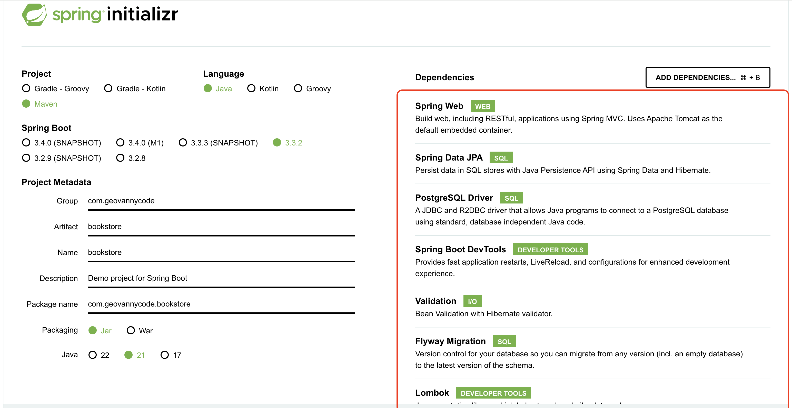
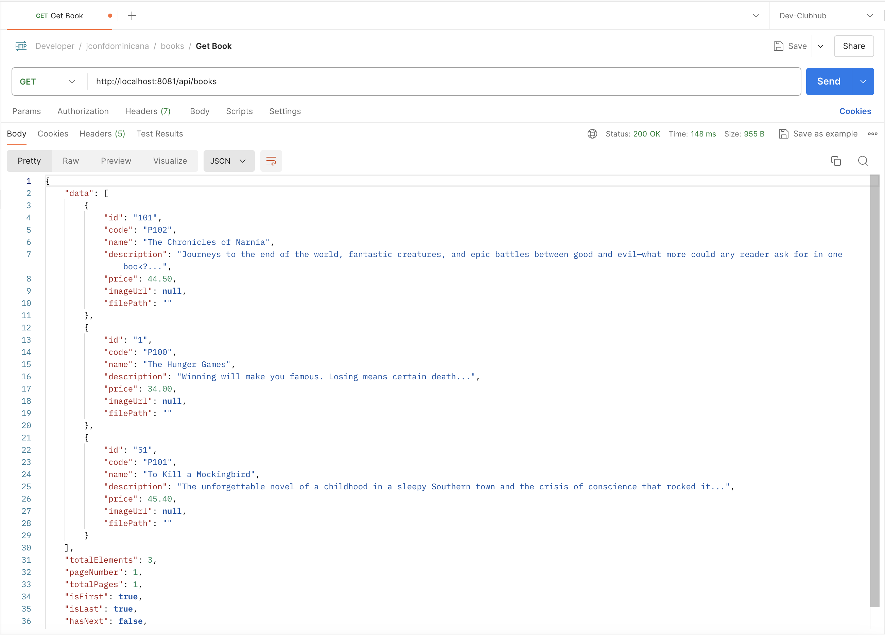
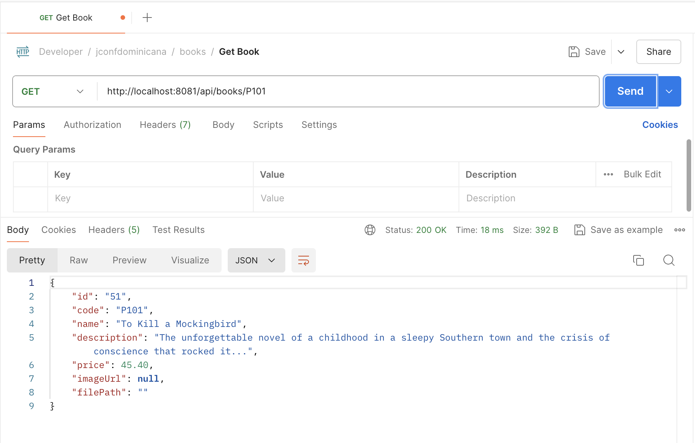
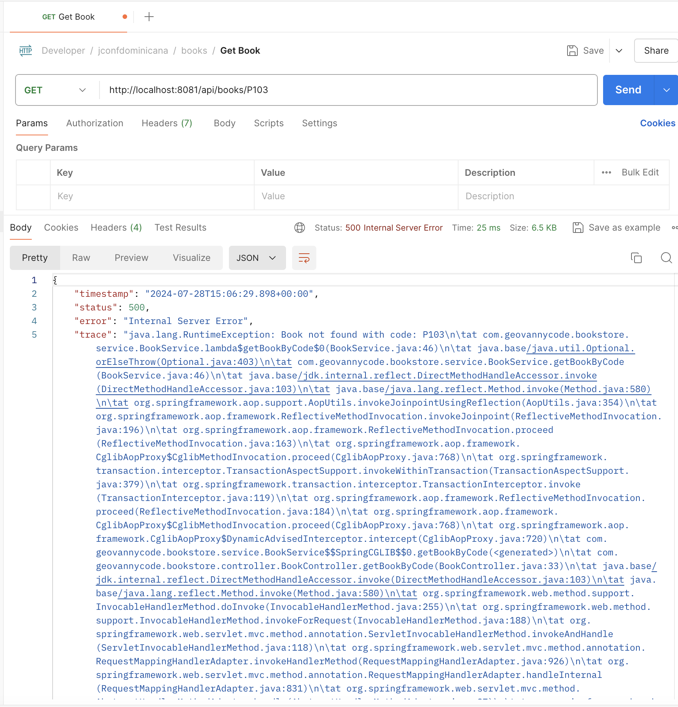
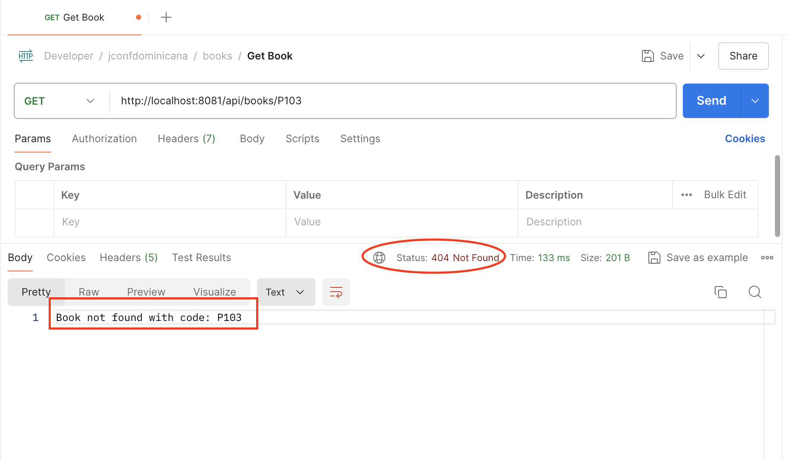
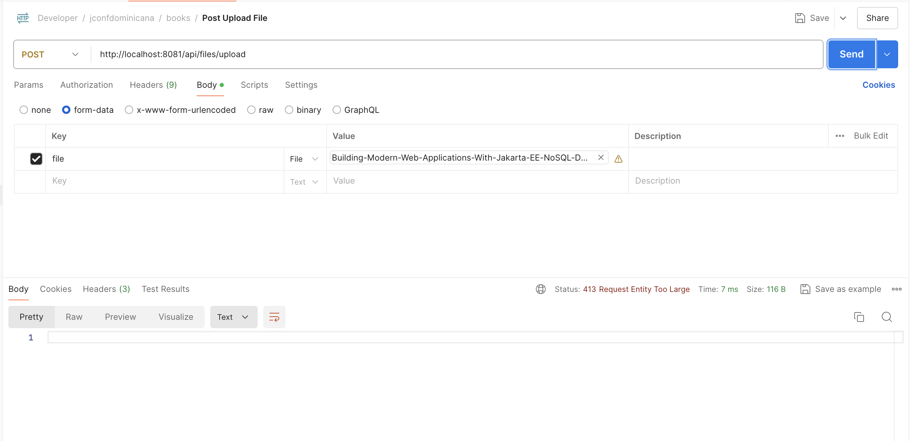
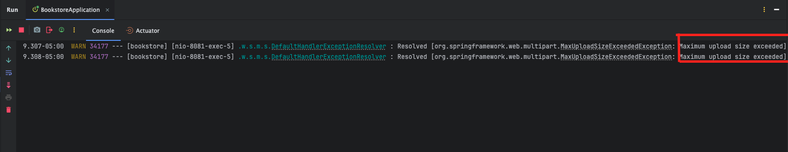
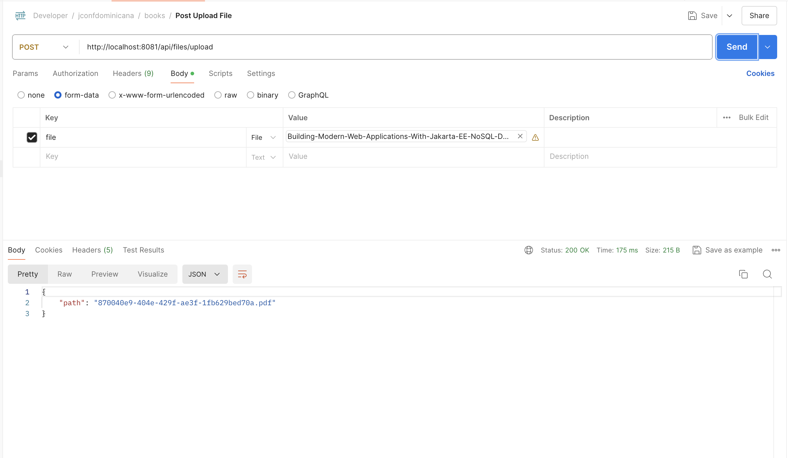
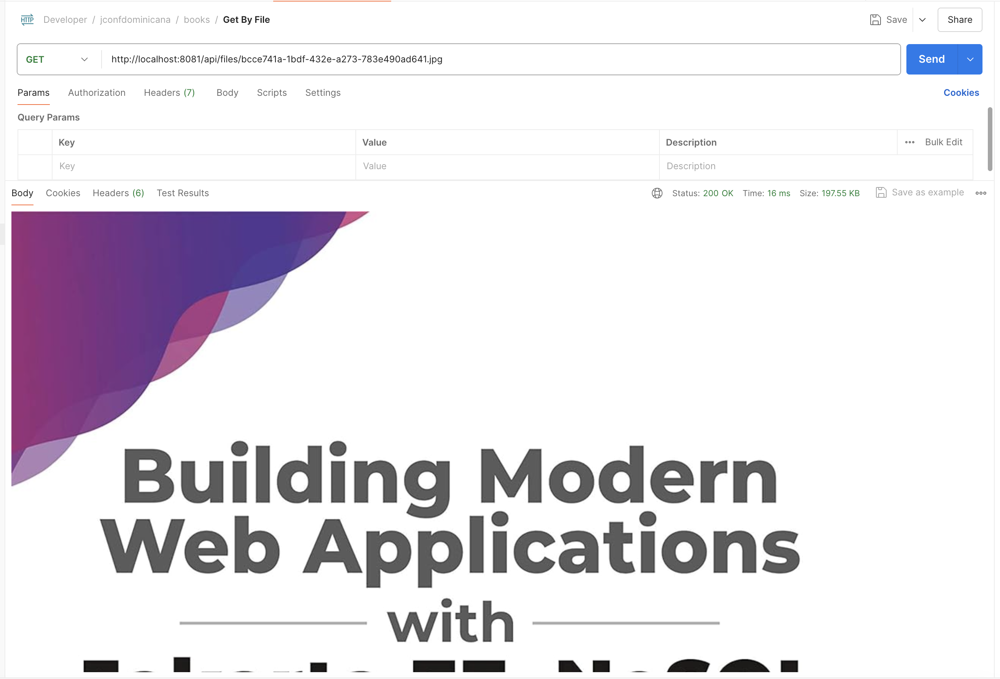

# **Crear Proyecto de Spring**

Para empezar, accedemos a [Spring initialzr](https://start.spring.io/) y configuramos el proyecto de la siguiente manera:

- **Project:** Maven
- **Language:** Java
- **Spring Boot:** 3.+ (la última versión estable)
- **Project Metadata:**
      - **Group:** com.geovannycodfigue
      - **Artifact:** bookstore
      - **Name:** bookstore
- **Packaging:** Jar
- **Java:** 21

## **Adicionar Dependencias**

Agregamos las siguientes dependencias en el archivo `pom.xml`:



### **Dependencias:**

```xml title="pom.xml"
    <dependency>
      <groupId>org.springframework.boot</groupId>
      <artifactId>spring-boot-starter-data-jpa</artifactId>
    </dependency>
    <dependency>
      <groupId>org.springframework.boot</groupId>
      <artifactId>spring-boot-starter-validation</artifactId>
    </dependency>
    <dependency>
      <groupId>org.springframework.boot</groupId>
      <artifactId>spring-boot-starter-web</artifactId>
    </dependency>
    <dependency>
      <groupId>org.flywaydb</groupId>
      <artifactId>flyway-core</artifactId>
    </dependency>
    <dependency>
      <groupId>org.flywaydb</groupId>
      <artifactId>flyway-database-postgresql</artifactId>
    </dependency>
    <dependency>
      <groupId>org.springframework.boot</groupId>
      <artifactId>spring-boot-devtools</artifactId>
      <scope>runtime</scope>
      <optional>true</optional>
    </dependency>
    <dependency>
      <groupId>org.postgresql</groupId>
      <artifactId>postgresql</artifactId>
      <scope>runtime</scope>
    </dependency>
    <dependency>
      <groupId>org.projectlombok</groupId>
      <artifactId>lombok</artifactId>
      <optional>true</optional>
    </dependency>
```

Una vez configurado el proyecto y añadidas las dependencias, generamos el proyecto y descargamos el archivo **.zip**. Lo descomprimimos y abrimos el proyecto en el IDE IntelliJ IDEA.

## **Creación Docker Componse**

### **Configuración del Entorno de Desarrollo con Docker Compose**

Para configurar el entorno de desarrollo, vamos a crear un archivo llamado `dev-stack.yml` que definirá los servicios necesarios utilizando Docker Compose. En este ejemplo, configuraremos un contenedor para PostgreSQL.

```yaml title="dev-stack.yml" linenums="1"
name: 'bookstore'
services:
  bookstore-db:
    image: postgres:16-alpine
    container_name: bookstore-db
    environment:
      - POSTGRES_USER=postgres
      - POSTGRES_PASSWORD=postgres
      - POSTGRES_DB=postgres
    ports:
      - "15432:5432"
    healthcheck:
      test: [ "CMD-SHELL", "pg_isready -U postgres" ]
      interval: 10s
      timeout: 5s
      retries: 5
    deploy:
      resources:
        limits:
          memory: 500m
```

- **Línea 1**: `name: 'bookstore'` Define el nombre del proyecto Docker Compose. Este nombre se usa para agrupar todos los servicios definidos en el archivo bajo un mismo proyecto.
- **Línea 2**: `services` Aquí se definen los servicios que se utilizarán en el entorno de desarrollo. En este caso, solo tenemos un servicio llamado bookstore-db.
- **Línea 4**: `image: postgres:16-alpine` Especifica la imagen de Docker que se utilizará para el contenedor de la base de datos PostgreSQL. En este caso, estamos usando la imagen postgres:16-alpine, que es una versión ligera de PostgreSQL.
- **Línea 5**: **container_name**: `bookstore-db` Define el nombre del contenedor.
- **Línea 6-9**: **environment**: Aquí se definen las variables de entorno necesarias para configurar PostgreSQL.
     - **POSTGRES_USER=postgres**: El nombre de usuario de PostgreSQL.
     - **POSTGRES_PASSWORD=postgres**: La contraseña del usuario de PostgreSQL.
     - **POSTGRES_DB=postgres**: El nombre de la base de datos por defecto.
- **Línea 10-11**: `ports` Mapea el puerto 5432 del contenedor al puerto 15432 en el host. Esto permite acceder a PostgreSQL en el puerto 15432 de tu máquina local.
- **Línea 12-16**: `healthcheck` Define un chequeo de salud para el contenedor.
    - `test: [ "CMD-SHELL", "pg_isready -U postgres" ]`: Comando que se ejecutará para verificar si la base de datos está lista.
    - `interval: 10s:` Intervalo de tiempo entre cada chequeo.
    - `timeout: 5s:` Tiempo máximo que se espera una respuesta antes de considerar el chequeo como fallido.
    - `retries: 5:` Número de intentos de chequeo fallidos antes de marcar el contenedor como no saludable.
- **Línea 17-20**: `deploy:` Configuraciones de despliegue.
    - `resources:` Limita los recursos del contenedor.
    - `limits:` Limita la cantidad de memoria que puede usar el contenedor.
    - `memory:` 500m: Límite de memoria establecido en 500MB.

Comandos para gestionar Docker Compose
Para iniciar y detener la base de datos con Docker Compose, utilizamos los siguientes comandos:

**Subir la base de datos**

```sh
docker compose -f dev-stack.yml up -d
```

Este comando levanta los servicios definidos en `dev-stack.yml` en modo detached (en segundo plano). La base de datos `PostgreSQL` se iniciará y estará disponible en el puerto `15432` de tu máquina local.

**Detener la base de datos**

```sh
docker compose -f dev-stack.yml down
```

Este comando detiene y elimina los contenedores, redes y volúmenes definidos en dev-stack.yml.

## **Creacion CRUD**

### **Creacion Entidad**

Primero, creamos los paquetes necesarios en el proyecto para organizar nuestro código de manera clara y estructurada. Los paquetes que necesitamos son:

* ```model```
* ```repository```
* ```service```
* ```controller```
* ```dto```
* ```mapper```

#### **Paso 1:** Crear la clase `BookEntity`

Dentro del paquete `model`, creamos una clase llamada `BookEntity` con los siguientes campos: `id`, `code`, `name`, `description`, `price`, `imageUrl`, `filePath`, `createdAt`, y `updatedAt`.

```java title="BookEntity.java" linenums="1"
package com.jconfdominicana.bookstore.model;

import jakarta.persistence.Column;
import jakarta.persistence.Entity;
import jakarta.persistence.GeneratedValue;
import jakarta.persistence.GenerationType;
import jakarta.persistence.Id;
import jakarta.persistence.SequenceGenerator;
import jakarta.persistence.Table;
import java.math.BigDecimal;
import java.time.LocalDateTime;
import lombok.AllArgsConstructor;
import lombok.Getter;
import lombok.NoArgsConstructor;
import lombok.Setter;

@Entity
@Table(name = "books")
@Getter
@Setter
@AllArgsConstructor
@NoArgsConstructor
public class BookEntity {

    @Id
    @GeneratedValue(strategy = GenerationType.SEQUENCE, generator = "book_id_generator")
    @SequenceGenerator(name = "book_id_generator", sequenceName = "book_id_seq")
    private Long id;

    @Column(nullable = false, unique = true)
    private String code;

    @Column(nullable = false)
    private String name;

    private String description;

    @Column(nullable = false)
    private BigDecimal price;

    @Column(name = "image_url")
    private String imageUrl;

    @Column(name = "file_path")
    private String filePath;

    @Column(name = "created", nullable = false, updatable = false)
    private LocalDateTime createdAt = LocalDateTime.now();

    @Column(name = "modified")
    private LocalDateTime updatedAt;
}
```

- **Línea 17**: `@Entity` Indica que esta clase es una entidad de JPA.
- **Línea 18**: `@Table(name = "books")` Especifica la tabla de base de datos con la que se mapeará esta entidad.
- **Líneas 19-22**:

```java
@Getter
@Setter
@AllArgsConstructor
@NoArgsConstructor
```

- **Anotaciones de Lombok**:
    - **@Getter**: Genera automáticamente los métodos getter para todos los campos.
    - **@Setter**: Genera automáticamente los métodos setter para todos los campos.
    - **@AllArgsConstructor**: Genera un constructor con un argumento para cada campo en la clase.
    - **@NoArgsConstructor**: Genera un constructor sin argumentos.
  
- **Líneas 25-27**:
  
```java
@Id
@GeneratedValue(strategy = GenerationType.SEQUENCE, generator = "book_id_generator")
@SequenceGenerator(name = "book_id_generator", sequenceName = "book_id_seq")
private Long id;
```

Configura el campo `id` como la clave primaria.

- **@Id**: Define el campo id como la clave primaria.
- **@GeneratedValue(strategy = GenerationType.SEQUENCE, generator = "book_id_generator")**: Especifica que el valor de este campo se generará automáticamente usando una secuencia.
- **@SequenceGenerator(name = "book_id_generator", sequenceName = "book_id_seq")**: Define el generador de secuencia para la clave primaria.

- **Líneas 30-31**:

```java
@Column(nullable = false, unique = true)
private String code;
```

Configura el campo `code` como una columna no nula y única.

- **Líneas 33-34**:

```java
@Column(nullable = false)
private String name;
```

Configura el campo `name` como una columna no nula.

- **Líneas 38-39**:

```java
@Column(nullable = false)
private BigDecimal price;
```

Configura el campo `price` como una columna no nula.

- **Nota**: En Java, `BigDecimal` es recomendado sobre `double` o `float` para representar valores numéricos de precisión arbitraria, especialmente en aplicaciones que requieren una alta precisión en cálculos numéricos, como es el caso de aplicaciones financieras y de comercio electrónico. Acá te explico las razones principales:
    - Con `BigDecimal`, puedes realizar operaciones aritméticas (suma, resta, multiplicación, división) con precisión garantizada. En double y float, las operaciones aritméticas pueden resultar en pérdida de precisión debido a la naturaleza del almacenamiento en punto flotante.
    - En aplicaciones financieras, los valores monetarios deben ser exactos. Un error de redondeo puede tener consecuencias significativas en cálculos de intereses, balances, precios, etc.
    - `BigDecimal` es la elección natural para estos contextos debido a su capacidad para manejar valores precisos y realizar cálculos sin errores de redondeo.

- **Línea 41-42**:

```java
@Column(name = "image_url")
private String imageUrl;
```

Configura el campo `imageUrl` como una columna opcional con un nombre específico en la base de datos.

- **Línea 44-45**:

```java
@Column(name = "file_path")
private String filePath;
```

Configura el campo `filePath` como una columna opcional con un nombre específico en la base de datos.

- **Líneas 47-48**:

```java
@Column(name = "created", nullable = false, updatable = false)
private LocalDateTime createdAt = LocalDateTime.now();
```

Configura el campo `createdAt` como una columna no nula que no se puede actualizar, inicializada con la fecha y hora actual.

- **Líneas 50-51**:

```java
@Column(name = "modified")
private LocalDateTime updatedAt;
```

Configura el campo `updatedAt` como una columna opcional con un nombre específico en la base de datos.

#### **Paso 2: Validación de la Entidad**

Para validar el modelo `BookEntity`, se ha añadido la siguiente anotacion de validación:

- **@Column**: Especifica que el campo es una columna en la base de datos.

Con esta configuración, la clase `BookEntity` está lista para ser utilizada como una entidad de base de datos en tu aplicación Spring Boot.

### **Creacion Repositorio**

#### **Paso 1: Crear el Repositorio para la Entidad `BookEntity`**

Dentro del paquete `repository`, creamos una interfaz llamada `BookRepository` que hereda de `JpaRepository<BookEntity, Long>`. Añadimos un método personalizado para encontrar un libro por su código.

```java title="BookRepository.java" linenums="1"
package com.jconfdominicana.bookstore.repository;

import com.jconfdominicana.bookstore.model.BookEntity;
import java.util.Optional;
import org.springframework.data.jpa.repository.JpaRepository;

public interface BookRepository extends JpaRepository<BookEntity, Long> {
    Optional<BookEntity> findByCode(String code);
}
```

- **Línea 5**:

```java
import org.springframework.data.jpa.repository.JpaRepository;
```

Importa la interfaz JpaRepository de Spring Data JPA.

- **Línea 7**:

```java
public interface BookRepository extends JpaRepository<BookEntity, Long> {
```

Define la interfaz `BookRepository` que hereda de `JpaRepository` para proporcionar operaciones CRUD.

- **Línea 8**:

```java
Optional<BookEntity> findByCode(String code);
```

Declara un método personalizado para encontrar un libro por su código.

#### **¿Qué es JpaRepository?**

`JpaRepository` es una interfaz de Spring Data JPA que extiende `CrudRepository` y `PagingAndSortingRepository`. Proporciona métodos adicionales para trabajar con la persistencia de datos de una manera más avanzada y eficiente.

**Diferencias entre JpaRepository y CrudRepository:**

- **CrudRepository**: Proporciona métodos CRUD básicos como `save`, `findAll`, `findById`, y `delete`.
- **JpaRepository**: Además de los métodos proporcionados por `CrudRepository`, incluye métodos adicionales para paginación y ordenación, como `findAll(Pageable pageable)` y `findAll(Sort sort)`. También tiene métodos para operaciones en batch y otros más avanzados.

**Métodos Personalizados**
En algunos casos, necesitamos métodos que no están disponibles por defecto en `JpaRepository`. Para esto, podemos definir métodos personalizados en nuestro repositorio.

**Ejemplo de Método Personalizado**:

```java
Optional<BookEntity> findByCode(String code);
```

Este método personalizado utiliza la convención de nomenclatura de Spring Data JPA para generar automáticamente la consulta SQL.

**Uso de JPQL para Consultas Personalizadas**

JPQL (Java Persistence Query Language) es una poderosa herramienta para escribir consultas personalizadas en Spring Data JPA. Podemos definir consultas utilizando la anotación `@Query`.

**Ejemplo de Uso de JPQL**:

```java
import org.springframework.data.jpa.repository.Query;

@Query("SELECT b FROM BookEntity b WHERE b.code = :code")
Optional<BookEntity> findByCodeJPQL(@Param("code") String code);
```

Esta consulta personalizada selecciona un `BookEntity` basado en el código utilizando JPQL.

### **Creacion DTO**

**¿Qué es un Record en Java?**
Un record es una nueva clase en Java introducida en la `versión 14` como una característica preliminar y estabilizada en la `versión 16`. Los records están diseñados para ser clases inmutables que se utilizan principalmente para contener datos. Proveen una manera concisa de declarar clases de datos, eliminando gran parte del código repetitivo.

**Características de los Records**:

- **Inmutabilidad**: Los campos de un record son finales por defecto. Esto significa que no se pueden cambiar una vez que se establece su valor. Es decir, una vez que se crea un objeto de record con ciertos valores, esos valores no pueden ser modificados. Esto ayuda a mantener la integridad de los datos y evita errores asociados con cambios inesperados.
- **Concisión**: Se generan automáticamente métodos como `equals`, `hashCode`, y `toString`. Esto reduce la cantidad de código que el desarrollador necesita escribir, ya que estas implementaciones suelen ser estándar y repetitivas.
- **Utilidad**: Facilitan la creación de clases de datos con menos código. Los records son especialmente útiles para definir objetos simples que solo contienen datos, sin lógica adicional.

#### **Paso 1: Crear el DTO**

- Dentro del paquete `dto`, creamos un `record` Java llamado `Book` con los campos `id`, `code`, `name`, `description`, `price`, `imageUrl`, y `filePath` de la entidad `BookEntity`. Añadimos validaciones a estos campos.

```java title="Book.java" linenums="1"
package com.jconfdominicana.bookstore.dto;

import jakarta.validation.constraints.DecimalMin;
import jakarta.validation.constraints.NotBlank;
import jakarta.validation.constraints.NotEmpty;
import jakarta.validation.constraints.NotNull;
import java.math.BigDecimal;

public record Book(
        String id,
        @NotEmpty(message = "Book code is required") String code,
        @NotEmpty(message = "Book name is required") String name,
        String description,
        @NotNull(message = "Book price is required") @DecimalMin("0.1") BigDecimal price,
        @NotBlank String imageUrl,
        @NotBlank String filePath) {}

```

- **Línea 9**:

```java
public record Book(
Define el record Book que encapsula los datos del libro.
```

- **Línea 11**:

```java
@NotEmpty(message = "Book code is required") String code,
```

Define el campo `code` y añade la validación `@NotEmpty`.

- **Línea 14**:

```java
@NotNull(message = "Book price is required") @DecimalMin("0.1") BigDecimal price,
```

Define el campo `price` y añade las validaciones `@NotNull` y `@DecimalMin`.

- **Línea 15**:

```java
@NotBlank String imageUrl,
```

Define el campo `imageUrl` y añade la validación `@NotBlank`.

#### **Paso 2: Validación del DTO**

Para validar el modelo `Book`, se han añadido las siguientes anotaciones de validación:

- **@NotEmpty**: Asegura que el campo no esté vacío. Se utiliza principalmente en campos de texto para asegurarse de que no sean nulos y que contengan al menos un carácter, excluyendo los espacios en blanco. Se aplica a los campos `code` y `name`.

**Ejemplo**:

```java
@NotEmpty(message = "Book code is required") String code,
```

Valida que el campo `code` no esté vacío.

- **@NotNull**: Asegura que el campo no sea nulo. Es útil para cualquier tipo de dato, asegurándose de que el campo debe tener un valor asignado. Se aplica al campo `price`.

**Ejemplo**:

```java
@NotNull(message = "Book price is required") @DecimalMin("0.1") BigDecimal 
price,
```

Valida que el campo `price` no sea nulo.

- **@DecimalMin**: Valida que el campo tenga un valor mínimo específico. Se utiliza en campos numéricos para asegurar que el valor sea igual o mayor que el valor especificado. Se aplica al campo `price`.

**Ejemplo**:

```java
@DecimalMin("0.1") BigDecimal price,
```

Valida que el campo `price` sea mayor o igual a 0.1.

- **@NotBlank**: Asegura que el campo no esté vacío y que no sea solo espacios en blanco. Es útil para campos de texto donde no solo se necesita que el campo no sea nulo, sino que también contenga caracteres no espaciales. Se aplica a los campos `imageUrl` y `filePath`.

**Ejemplo**:

```java
@NotBlank String imageUrl,
```

Valida que el campo `imageUrl` no esté vacío y no contenga solo espacios en blanco.
Con esta configuración, tanto la clase `BookEntity` como el DTO `Book` están listos para ser utilizados en tu aplicación Spring Boot.
  
### **Creacion Servicio**

#### **Paso 1: Crear las Dependencias Necesarias**

**Creación de `ApplicationProperties`**

Dentro del paquete `config`, creamos un `record` Java llamado `ApplicationProperties` que encapsula las propiedades de configuración de la aplicación.

```java title="ApplicationProperties.java" linenums="1"
@ConfigurationProperties(prefix = "book")
public record ApplicationProperties(@DefaultValue("10") @Min(1) int pageSize) {}
```

- **Línea 1**:

```java
@ConfigurationProperties(prefix = "book")
```

 - Esta anotación indica que las propiedades de configuración de este `record` estarán prefijadas con `book` en el archivo `application.properties` o `application.yml`. 
     - Por ejemplo:
         - `book.pageSize=10`

- **Líneas 2**:

```java
public record ApplicationProperties(@DefaultValue("10") @Min(1) int pageSize) {}
```

Define el `record` `ApplicationProperties` que encapsula las propiedades de configuración. El campo `pageSize` asegura que el tamaño de página mínimo sea 1 y tiene un valor predeterminado de 10.

**Anotación en la Clase Principal**

Para habilitar el escaneo y la configuración automática de las propiedades, añadimos la anotación `@ConfigurationPropertiesScan` en la clase principal `BookstoreApplication`.

```java title="BookstoreApplication.java" linenums="1"
import org.springframework.boot.context.properties.ConfigurationPropertiesScan;
import org.springframework.boot.SpringApplication;
import org.springframework.boot.autoconfigure.SpringBootApplication;

@SpringBootApplication
@ConfigurationPropertiesScan
public class BookstoreApplication {
    public static void main(String[] args) {
        SpringApplication.run(BookstoreApplication.class, args);
    }
}
```

- **Anotación** `@ConfigurationPropertiesScan`:

    - Habilita el escaneo de las clases anotadas con `@ConfigurationProperties` en el paquete y sus subpaquetes. Esto es necesario para que Spring Boot detecte y configure las propiedades automáticamente.

#### **Paso 2: Creacion de `BookMapper`**

Dentro del paquete `mapper`, creamos una clase llamada `BookMapper` que contiene métodos para convertir entre `BookEntity` y `Book`.

```java title="BookMapper.java" linenums="1"
package com.jconfdominicana.bookstore.mapper;

import com.jconfdominicana.bookstore.dto.Book;
import com.jconfdominicana.bookstore.model.BookEntity;

public class BookMapper {
    public static Book toBook(BookEntity entity) {
        return new Book(
                entity.getId().toString(),
                entity.getCode(),
                entity.getName(),
                entity.getDescription(),
                entity.getPrice(),
                entity.getImageUrl(),
                entity.getFilePath());
    }

    public static BookEntity toEntity(Book book) {
        return new BookEntity(
                Long.valueOf(book.id()),
                book.code(),
                book.name(),
                book.description(),
                book.price(),
                book.imageUrl(),
                book.filePath(),
                null,
                null);
    }
}
```

- **Líneas 6-16**:

```java
public static Book toBook(BookEntity entity) {
    return new Book(
            entity.getId().toString(),
            entity.getCode(),
            entity.getName(),
            entity.getDescription(),
            entity.getPrice(),
            entity.getImageUrl(),
            entity.getFilePath());
}
```

Define el método `toBook` que convierte un `BookEntity` en un `Book`.

- **Líneas 18-29**:

```java
public static BookEntity toEntity(Book book) {
    return new BookEntity(
            Long.valueOf(book.id()),
            book.code(),
            book.name(),
            book.description(),
            book.price(),
            book.imageUrl(),
            book.filePath(),
            null,
            null);
}
```

Define el método `toEntity` que convierte un `Book` en un `BookEntity`.

**Beneficios de Usar un `Mapper`**

- **Separación de Responsabilidades**: Usar un `mapper` permite mantener una clara separación entre la lógica de la aplicación y la lógica de persistencia. Esto significa que las clases de entidad (`@Entity`) solo se utilizan para la persistencia de datos, mientras que los DTO (Data Transfer Objects) se utilizan para transferir datos entre las capas de la aplicación.

- **Simplificación del Código**: Los mappers simplifican el código al encapsular la lógica de conversión entre entidades y DTOs en un solo lugar. Esto reduce la repetición de código y hace que el mantenimiento sea más sencillo.

- **Mejor Mantenibilidad**: Si cambian los requisitos de la aplicación, es más fácil actualizar la lógica de mapeo en una sola clase en lugar de buscar y actualizar múltiples lugares en el código.

- **Flexibilidad**: Permite personalizar los objetos que se envían y reciben en las diferentes capas de la aplicación sin afectar directamente a las entidades de base de datos. Por ejemplo, puedes agregar campos adicionales en el DTO para fines de visualización sin cambiar la estructura de la base de datos.

- **Evita Exposición de Entidades**: No se recomienda exponer directamente las entidades (`@Entity`) a las capas superiores de la aplicación (como la capa de presentación). Esto protege las entidades de cambios accidentales y asegura que solo los datos necesarios se transfieran entre las capas.

#### **Paso 3: Crear la Clase del Servicio**

Dentro del paquete `service`, creamos una clase llamada `BookService`. Usamos las anotaciones `@Service` y `@Transactional` para indicar que esta clase es un servicio de Spring y que las transacciones deben ser manejadas automáticamente.

**Definir la Clase del Servicio**

```java title="BookService.java" linenums="1"
package com.jconfdominicana.bookstore.service;

import com.jconfdominicana.bookstore.config.ApplicationProperties;
import com.jconfdominicana.bookstore.dto.Book;
import com.jconfdominicana.bookstore.dto.PagedResult;
import com.jconfdominicana.bookstore.mapper.BookMapper;
import com.jconfdominicana.bookstore.model.BookEntity;
import com.jconfdominicana.bookstore.repository.BookRepository;
import org.springframework.beans.factory.annotation.Autowired;
import org.springframework.data.domain.Page;
import org.springframework.data.domain.PageRequest;
import org.springframework.data.domain.Pageable;
import org.springframework.data.domain.Sort;
import org.springframework.stereotype.Service;
import org.springframework.transaction.annotation.Transactional;

@Service
@Transactional
public class BookService {

    private final BookRepository bookRepository;
    private final ApplicationProperties properties;

    public BookService(BookRepository bookRepository, ApplicationProperties properties) {
        this.bookRepository = bookRepository;
        this.properties = properties;
    }

    public PagedResult<Book> getBooks(int pageNo) {
        Sort sort = Sort.by("name").ascending();
        pageNo = pageNo <= 1 ? 0 : pageNo - 1;
        Pageable pageable = PageRequest.of(pageNo, properties.pageSize(), sort);
        Page<Book> booksPage = bookRepository.findAll(pageable).map(BookMapper::toBook);

        return new PagedResult<>(
                booksPage.getContent(),
                booksPage.getTotalElements(),
                booksPage.getNumber() + 1,
                booksPage.getTotalPages(),
                booksPage.isFirst(),
                booksPage.isLast(),
                booksPage.hasNext(),
                booksPage.hasPrevious());
    }

    public Book getBookByCode(String code) {
        BookEntity bookEntity = bookRepository.findByCode(code)
                .orElseThrow(() -> new RuntimeException ("Book not found with code: " + code));
        return BookMapper.toBook(bookEntity);
    }

    public Book saveBook(Book book) {
        BookEntity bookEntity = BookMapper.toEntity(book);
        bookEntity = bookRepository.save(bookEntity);
        return BookMapper.toBook(bookEntity);
    }
}

```

- **Líneas 17-18**:
    - **`@Service`**: Indica que esta clase es un servicio de Spring.
    - **`@Transactional`**: Asegura que todas las operaciones en el servicio sean transaccionales.
- **Líneas 19-27**:

```java
public class BookService {
    private final BookRepository bookRepository;
    private final ApplicationProperties properties;
    
    public BookService(BookRepository bookRepository, ApplicationProperties properties) {
        this.bookRepository = bookRepository;
        this.properties = properties;
    }
}
```

Define el constructor que inyecta las dependencias `BookRepository` y `ApplicationProperties`.

**Método para Recuperar Libros Usando Paginación**

- **Líneas 29-44**:

```java
public PagedResult<Book> getBooks(int pageNo) {
    Sort sort = Sort.by("name").ascending();
    pageNo = pageNo <= 1 ? 0 : pageNo - 1;
    Pageable pageable = PageRequest.of(pageNo, properties.pageSize(), sort);
    Page<Book> booksPage = bookRepository.findAll(pageable).map(BookMapper::toBook);

    return new PagedResult<>(
            booksPage.getContent(),
            booksPage.getTotalElements(),
            booksPage.getNumber() + 1,
            booksPage.getTotalPages(),
            booksPage.isFirst(),
            booksPage.isLast(),
            booksPage.hasNext(),
            booksPage.hasPrevious());
}
```

- **`getBooks(int pageNo)`**: Método para recuperar los libros usando paginación.
- **`Sort sort = Sort.by("name").ascending()`**: Define la ordenación ascendente por el campo `name`.
- **`Pageable pageable = PageRequest.of(pageNo, properties.pageSize(), sort)`**: Crea un objeto `Pageable` con la página actual, el tamaño de página y la ordenación.
- **`Page<Book> booksPage = bookRepository.findAll(pageable).map(BookMapper::toBook)`**: Recupera una página de libros y los convierte a DTO `Book`.
- **`return new PagedResult<>(...)`**: Retorna un objeto PagedResult con los detalles de la página de libros.

**Método para Recuperar Libros por el Campo code**

- **Líneas 46-50**:

```java
public Book getBookByCode(String code) {
    BookEntity bookEntity = bookRepository.findByCode(code)
            .orElseThrow(() -> new RuntimeException ("Book not found with code: " + code));
    return BookMapper.toBook(bookEntity);
}
```

- **`getBookByCode(String code)`**: Método para recuperar un libro por su código.
- **`bookRepository.findByCode(code)`**: Busca un libro por su código.
- **`.orElseThrow(...)`**: Lanza una excepción si el libro no se encuentra.
- **`return BookMapper.toBook(bookEntity)`**: Convierte y retorna el 
`BookEntity` a un DTO `Book`.

**Método para Guardar un Libro**

- **Líneas 52-56**:

```java
public Book saveBook(Book book) {
    BookEntity bookEntity = BookMapper.toEntity(book);
    bookEntity = bookRepository.save(bookEntity);
    return BookMapper.toBook(bookEntity);
}
```

- **`saveBook(Book book)`**: Método para guardar un libro.
- **`BookEntity bookEntity = BookMapper.toEntity(book)`**: Convierte el DTO `Book` en una entidad `BookEntity`.
- **`bookEntity = bookRepository.save(bookEntity)`**: Guarda la entidad en la base de datos.
- **`return BookMapper.toBook(bookEntity)`**: Convierte y retorna la entidad guardada como un DTO `Book`.

### **Creacion Paginación**

La paginación es una técnica utilizada para dividir un conjunto grande de datos en partes más pequeñas, llamadas páginas, para facilitar su visualización y manipulación. En una aplicación web, la paginación permite cargar y mostrar datos de manera eficiente, mejorando la experiencia del usuario y el rendimiento del sistema.

**Paso 1: Crear la Clase PagedResult**
Dentro del paquete `dto`, creamos un `record` Java llamado `PagedResult` que encapsula los datos de la paginación. Un `record` en Java es una clase especial que proporciona una manera concisa de definir clases inmutables con campos.

```java title="PagedResult.java" linenums="1"
public record PagedResult<T>(
        List<T> data,
        long totalElements,
        int pageNumber,
        int totalPages,
        boolean isFirst,
        boolean isLast,
        boolean hasNext,
        boolean hasPrevious) {}
```

- **Línea 1**: **`public record PagedResult<T>()`**: Define el `record` `PagedResult` que encapsula los datos de la paginación. El uso de `record` en Java permite crear una clase inmutable con un conjunto fijo de campos.

**Campos de PagedResult**

- **Línea 2**: **`List<T> data`**: Una lista que contiene los datos de la página actual. El tipo genérico `T` permite que `PagedResult` sea reutilizable para cualquier tipo de datos.

    ```java
        List<T> data
    ```

    - **`data`**: Los elementos de la página actual.

- **Línea 3**: **`long totalElements`**: El número total de elementos en el conjunto de datos completo.

    ```java
    long totalElements
    ```

    - **`totalElements`**: El total de elementos en la colección completa.

- **Línea 4**: **`int pageNumber`**: El número de la página actual (comenzando desde 1).

    ```java
    int pageNumber
    ```

    - **`pageNumber`**: El número de la página actual, útil para la navegación.

- **Línea 5**: **`int totalPages`**: El número total de páginas disponibles.

    ```java
    int totalPages
    ```

    - **`totalPages`**: El total de páginas basado en el tamaño de página y el número total de elementos.

- **Línea 6**: **boolean isFirst**: Un indicador booleano que indica si esta es la primera página.

    ```java
    boolean isFirst
    ```

    - **isFirst**: true si es la primera página, de lo contrario false.

- **Línea 7**: **boolean isLast**: Un indicador booleano que indica si esta es la última página.

    ```java
    boolean isLast
    ```

    - **`isLast`**: true si es la última página, de lo contrario false.

- **Línea 8**: **boolean hasNext**: Un indicador booleano que indica si hay una página siguiente disponible.

    ```java
    boolean hasNext
    ```

    - **`hasNext`**: true si hay una página siguiente, de lo contrario false.

- **Línea 9**: **boolean hasPrevious**: Un indicador booleano que indica si hay una página anterior disponible.

    ```java
    boolean hasPrevious
    ```

    - **`hasPrevious`**: true si hay una página anterior, de lo contrario false.
  
**Uso del PagedResult**

El `PagedResult` se utiliza en el servicio para encapsular los resultados de la paginación y devolverlos al cliente de una manera estructurada y fácil de usar.

### **Creación Controlador**

#### **Descripción del Controlador**

El controlador es la capa de la aplicación encargada de manejar las solicitudes HTTP, procesarlas y devolver las respuestas apropiadas. Utilizamos la anotación `@RestController` para definir un controlador RESTful en Spring Boot.

| Método      | Descripción                          |
| ----------- | ------------------------------------ |
| `GET`       | :material-check:     Recupera recursos  |
| `POST`      | :material-content-save-check: Guarda recursos |
| `PUT`       | :material-check-all: Actualiza recursos |
| `DELETE`    | :material-close:     Elimina recursos |

#### **Paso 1: Creación de la Clase `BookController`**

1. **Definir la Clase del Controlador**: En el paquete `controller` de la aplicación, crear una clase llamada `BookController`.
2. **Anotar la Clase como un Controlador REST**: Utilizar la anotación `@RestController` para convertir la clase en un controlador REST.
3. **Inyectar el Servicio**: Inyectar `BookService` para manejar la lógica de negocio.
4. **Definir los Métodos del Controlador**: Crear métodos para manejar las diferentes operaciones CRUD (Create, Read, Update, Delete) para la entidad `Book`.

```java title="BookController.java" linenums="1"
package com.jconfdominicana.bookstore.controller;

import com.jconfdominicana.bookstore.dto.Book;
import com.jconfdominicana.bookstore.dto.PagedResult;
import com.jconfdominicana.bookstore.exception.BookNotFoundException;
import com.jconfdominicana.bookstore.service.BookService;
import org.springframework.beans.factory.annotation.Autowired;
import org.springframework.http.HttpStatus;
import org.springframework.http.ResponseEntity;
import org.springframework.web.bind.annotation.*;

@RestController
@RequestMapping("/api/books")
public class BookController {

    private final BookService bookService;

    @Autowired
    public BookController(BookService bookService) {
        this.bookService = bookService;
    }

    @GetMapping
    public PagedResult<Book> getBooks(@RequestParam(name = "page", defaultValue = "1") int pageNo) {
        return bookService.getBooks(pageNo);
    }

    @GetMapping("/{code}")
    public ResponseEntity<Book> getBookByCode(@PathVariable String code) {
        Book book = bookService.getBookByCode(code);
        return ResponseEntity.ok(book);
    }

    @PostMapping
    public ResponseEntity<Book> createBook(@RequestBody Book book) {
        Book createdBook = bookService.saveBook(book);
        return new ResponseEntity<>(createdBook, HttpStatus.CREATED);
    }
}
```

**Descripción de los Métodos**

**Método `getBooks`**

- **Propósito**: Recupera una lista paginada de libros.
- **Ruta**: `/api/books`
- **Método HTTP**: **`GET`**
- **Anotación**: **`@GetMapping`** indica que este método manejará solicitudes GET a la ruta `/books`.
- **Parámetro**: `page` (opcional, valor por defecto: 1). Utiliza `@RequestParam` para capturar el parámetro de la solicitud HTTP.
- **Retorno**: `PagedResult<Book>` con los libros paginados.

```java
@GetMapping
public PagedResult<Book> getBooks(@RequestParam(name = "page", defaultValue = "1") int pageNo) {
    return bookService.getBooks(pageNo);
}
```

**Método `getBookByCode`**

- **Propósito**: Recupera un libro por su código.
- **Ruta**: `/api/books/{code}`
- **Método HTTP**: **`GET`**
- **Anotación**: `@GetMapping` indica que este método manejará solicitudes GET a la ruta `/books/{code}`.
- **Parámetro**: `code` (obligatorio). Utiliza `@PathVariable` para capturar el parámetro de la ruta.
- **Retorno**: `ResponseEntity<Book>` con el libro encontrado.

```java
@GetMapping("/{code}")
public ResponseEntity<Book> getBookByCode(@PathVariable String code) {
    Book book = bookService.getBookByCode(code);
    return ResponseEntity.ok(book);
}
```

**Método `createBook`**

- **Propósito**: Crea un nuevo libro.
- **Ruta**: `/api/books`
- **Método HTTP**: **`POST`**
- **Anotación**: `@PostMapping` indica que este método manejará solicitudes POST a la ruta `/books`.
- **Parámetro**: `Book` (en el cuerpo de la solicitud). Utiliza `@RequestBody` para capturar el cuerpo de la solicitud HTTP.
- **Retorno**: `ResponseEntity<Book>` con el libro creado y el estado HTTP 201 (Created).

```java

@PostMapping
public ResponseEntity<Book> createBook(@RequestBody Book book) {
    Book createdBook = bookService.saveBook(book);
    return new ResponseEntity<>(createdBook, HttpStatus.CREATED);
}
```

### **Adicionar configuracion Properties**

El archivo `application.properties` se utiliza en Spring Boot para configurar varias propiedades de la aplicación. Aquí, configuramos el nombre de la aplicación, el puerto del servidor, la configuración de apagado del servidor, la exposición de puntos finales de gestión y la configuración específica del servicio y de la base de datos.

**Configuración Básica de la Aplicación**

```properties title="application.properties" linenums="1"
spring.application.name=bookstore
server.port=8081
server.shutdown=graceful
management.endpoints.web.exposure.include=*
management.info.git.mode=full

######## Book Service Configuration  #########
book.page-size=10

######## Database Configuration  #########
spring.datasource.url=${DB_URL:jdbc:postgresql://localhost:15432/postgres}
spring.datasource.username=${DB_USERNAME:postgres}
spring.datasource.password=${DB_PASSWORD:postgres}
spring.jpa.open-in-view=false
```

- **Línea 1-5**:
    - **`spring.application.name=bookstore`**: Define el nombre de la aplicación.
    - **`server.port=8081`**: Establece el puerto en el que la aplicación se ejecutará. En este caso, el puerto 8081.
    - **`server.shutdown=graceful`**: Configura el servidor para realizar un apagado ordenado, permitiendo que las solicitudes actuales se completen antes de apagar el servidor.
    - **`management.endpoints.web.exposure.include=*`**: Expone todos los Endpoint de gestión.
    - **`management.info.git.mode=full`**: Configura el modo de exposición de información de Git a `full`.

- **Línea 8**:
    - **book.page-size=10**: Define el tamaño de la página para la paginación del servicio de libros. Esto significa que cada página tendrá un máximo de 10 libros.

- **Línea 11-14**:  
    - **`spring.datasource.url=${DB_URL:jdbc:postgresql://localhost:15432/postgres`**: Configura la URL de la base de datos. Utiliza una variable de entorno `DB_URL` si está disponible; de lo contrario, usa el valor por defecto `jdbc:postgresql://localhost:15432/postgres`.
    - **`spring.datasource.username=${DB_USERNAME:postgres}`**: Configura el nombre de usuario de la base de datos. Utiliza una variable de entorno `DB_USERNAME` si está disponible; de lo contrario, usa el valor por defecto `postgres`.
    - **`spring.datasource.password=${DB_PASSWORD:postgres}`**: Configura la contraseña de la base de datos. Utiliza una variable de entorno `DB_PASSWORD` si está disponible; de lo contrario, usa el valor por defecto `postgres`.
    - **`spring.jpa.open-in-view=false`**: Desactiva la opción de open-in-view para mejorar el rendimiento.  
  
### **Adicionar flyway**

Flyway es una herramienta de migración de base de datos que ayuda a gestionar cambios en el esquema de la base de datos de manera controlada y versionada. Utilizaremos Flyway para crear y poblar la tabla books.

**Archivo de Migración `V1__create_books_table.sql`**
Este archivo crea la secuencia y la tabla `books`.

```sql title="V1__create_books_table.sql"
create sequence book_id_seq start with 1 increment by 50;

create table books (
    id bigint default nextval('book_id_seq') not null ,
    code text not null unique,
    name varchar(255) not null,
    description text,
    price numeric not null,
    cover_path varchar(250) DEFAULT NULL,
    file_path varchar(250) DEFAULT NULL,
    created timestamp NOT NULL,
    modified timestamp DEFAULT NULL,
    primary key (id)
);
```

- **`create sequence book_id_seq start with 1 increment by 50;`**: Crea una secuencia para generar los identificadores únicos de los libros, comenzando en 1 y aumentando en 50.
- **`create table books (...)`**: Crea la tabla books con los siguientes campos:
    - **`id`**: Identificador único de tipo bigint, generado automáticamente utilizando la secuencia book_id_seq.
    - **`code`**: Código del libro, de tipo text, único y no nulo.
    - **`name`**: Nombre del libro, de tipo varchar(255), no nulo.
    - **`description`**: Descripción del libro, de tipo text.
    - **`price`**: Precio del libro, de tipo numeric, no nulo.
    - **`cover_path`**: Ruta de la imagen de portada del libro, de tipo varchar(250), opcional.
    - **`file_path`**: Ruta del archivo del libro, de tipo varchar(250), opcional.
    - **`created`**: Fecha de creación del registro, de tipo timestamp, no nulo.
    - **`modified`**: Fecha de modificación del registro, de tipo timestamp, opcional.
    - **`primary key (id)`**: Define id como la clave primaria de la tabla.

**Archivo de Datos `V2__add_books_data.sql`**

Este archivo inserta datos iniciales en la tabla books.

```sql title="V2__add_books_data.sql"
insert into books(code, name, description, price, cover_path, file_path,created) values
('P100','The Hunger Games','Winning will make you famous. Losing means certain death...', 34.0,'','',current_timestamp),
('P101','To Kill a Mockingbird','The unforgettable novel of a childhood in a sleepy Southern town and the crisis of conscience that rocked it...', 45.40,'','', current_timestamp),
('P102','The Chronicles of Narnia','Journeys to the end of the world, fantastic creatures, and epic battles between good and evil—what more could any reader ask for in one book?...', 44.50,'','', current_timestamp);
```

### **Probar el Endpoint**

#### **Probando el Endpoint General**

Esta es la url que vamos a probar:

```bash
curl --location 'http://localhost:8081/api/books'
```

El resultado esperado es el siguiente:

En esta respuesta, podemos observar que se obtiene una lista de libros disponibles en nuestra base de datos. Cada libro contiene información detallada como `id`, `código`, `nombre`, `descripción`, `precio`, entre otros.

Para realizar esta prueba en Postman:

   1. **Configurar la Solicitud**:
      - Método: GET
      - URL: `http://localhost:8081/api/books`
   2. **Ejecutar la Prueba**:
      - Hacer clic en el botón **"Send"** y observar el resultado en la pestaña **"Body"**.

El resultado esperado en Postman es similar a la imagen proporcionada.



#### **Probando el Endpoint por Código de Libro**

Vamos a probar el segundo endpoint, donde realizaremos una búsqueda específica por el código del libro. La URL que utilizaremos es:

```bash
curl --location 'http://localhost:8081/api/books/P101'
```

El resultado esperado es el siguiente:

Aquí, podemos observar la información detallada de un libro específico identificado por el código `P101`.

Para realizar esta prueba en Postman:

   1. **Configurar la Solicitud**:
      - Método: GET
      - URL: `http://localhost:8081/api/books/P101`

   2. **Ejecutar la Prueba**:
      - Hacer clic en el botón **"Send"** y observar el resultado en la pestaña **"Body"**.

El resultado esperado en Postman es similar a la imagen proporcionada.



#### **Manejo de Errores para Códigos No Existentes**

Nos preguntamos qué pasa si en esta consulta le enviamos un código de libro que no existe. Vamos a probar con el código `P103`:

```bash
curl --location 'http://localhost:8081/api/books/P103'
```

El resultado obtenido es el siguiente:



En este caso, observamos que el resultado no es el esperado, ya que se retorna un estado `500 Internal Server Error` en lugar de un `404 Not Found`. Esto indica que el servidor no manejó adecuadamente la ausencia del libro con el código proporcionado.

#### **Corrigiendo el Manejo de Errores**

Para manejar este tipo de errores de manera adecuada y proporcionar una respuesta más descriptiva, vamos a realizar las siguientes correcciones en nuestro código:

1. **Actualizar el Servicio**:
      - Modificar el método de servicio para lanzar una excepción controlada en lugar de una excepción genérica.
2. **Controlador de Excepciones Globales**:
      - Implementar un controlador de excepciones globales en nuestro proyecto Spring Boot para manejar los errores de manera centralizada.

Con estas modificaciones, lograremos que el sistema retorne un estado `404 Not Found` cuando se busque un libro que no existe en la base de datos, detallando mejor los errores que nos encontremos y mejorando la experiencia del usuario.

### **Manejo de Excepciones de la API**

El manejo de excepciones en una API es crucial para proporcionar mensajes de error claros y útiles cuando algo sale mal. Esto ayuda a los clientes de la API a entender por qué una solicitud falló y cómo pueden corregirla. Vamos a crear una excepción personalizada `BookNotFoundException` y un manejador global de excepciones para nuestra API.

#### **Excepción Personalizada `BookNotFoundException`**

La excepción `BookNotFoundException` se utiliza para manejar la situación en la que no se encuentra un libro con el código especificado en la base de datos. Esta excepción permite devolver un código de estado `HTTP 404 (Not Found)` con un mensaje claro que indica el problema.

```java title="BookNotFoundException.java"
public class BookNotFoundException extends RuntimeException {
    public BookNotFoundException(String message) {
        super(message);
    }

    public static BookNotFoundException forCode(String code) {
        return new BookNotFoundException("Book with code " + code + " not found");
    }
}
```

#### **Implementación Excepciones de la API**

1. **Crear la Clase de Excepción**: Dentro del paquete `exception`, crear una clase llamada `BookNotFoundException`.

```java
package com.jconfdominicana.bookstore.exception;

/**
 * Excepción personalizada para manejar el caso en el que un libro no se encuentra
 * en la base de datos.
 */
public class BookNotFoundException extends RuntimeException {
    /**
     * Constructor que acepta un mensaje de error.
     *
     * @param message El mensaje de error.
     */
    public BookNotFoundException(String message) {
        super(message);
    }

    /**
     * Método estático para crear una excepción con un mensaje específico
     * para el código del libro.
     *
     * @param code El código del libro no encontrado.
     * @return Una nueva instancia de BookNotFoundException.
     */
    public static BookNotFoundException forCode(String code) {
        return new BookNotFoundException("Book with code " + code + " not found");
    }
}
```

**Descripción del Código**

- **Clase `BookNotFoundException`**:
    - **Propósito**: Manejar la situación en la que un libro no se encuentra en la base de datos.
    - **Herencia**: Extiende `RuntimeException` para ser utilizada como una excepción no verificada.

- **Constructor**:
    - Acepta un mensaje de error como parámetro y lo pasa a la clase base `RuntimeException`.

- **Método estático forCode**:
    - Facilita la creación de una instancia de `BookNotFoundException` con un mensaje específico que incluye el código del libro no encontrado.

#### **Manejando Excepciones de Forma Global**

Para manejar las excepciones de forma global y devolver respuestas HTTP apropiadas, podemos crear un manejador global de excepciones usando @ControllerAdvice.

#### **Implementación Excepciones de Forma Global**

- **Crear la Clase de Manejador Global de Excepciones**: Dentro del paquete `exception`, crear una clase llamada `GlobalExceptionHandler`.

```java
package com.jconfdominicana.bookstore.exception;

import org.springframework.http.HttpStatus;
import org.springframework.http.ResponseEntity;
import org.springframework.web.bind.annotation.ExceptionHandler;
import org.springframework.web.bind.annotation.RestControllerAdvice;

/**
 * Manejador global de excepciones para la aplicación.
 */
@RestControllerAdvice
public class GlobalExceptionHandler {

    /**
     * Maneja la excepción BookNotFoundException.
     *
     * @param ex La excepción capturada.
     * @return Una respuesta HTTP con el mensaje de error y el estado 404.
     */
    @ExceptionHandler(BookNotFoundException.class)
    public ResponseEntity<String> handleBookNotFoundException(BookNotFoundException ex) {
        return new ResponseEntity<>(ex.getMessage(), HttpStatus.NOT_FOUND);
    }

    // Otros manejadores de excepciones pueden ser añadidos aquí
}
```

**Descripción del Código**

- **Clase `GlobalExceptionHandler`**:
    - **Propósito**: Manejar excepciones de forma global en la aplicación.
    - **Anotación `@RestControllerAdvice`**: Indica que esta clase proporciona consejos globales para los controladores y maneja excepciones arrojadas por los métodos de controlador.

- **Método `handleBookNotFoundException`**:
    - **Propósito**: Manejar la excepción `BookNotFoundException`.
    - **Anotación `@ExceptionHandler(BookNotFoundException.class)`**: Indica que este método manejará excepciones de tipo BookNotFoundException.
    - **Parámetro `ex`**: La excepción capturada.
    - **Retorno**: Devuelve una respuesta HTTP con el mensaje de error y el estado `404 (Not Found)`.

#### **Implementando las Excepciones en el Servicio**

Modificamos en la clase de servicio el método getBookByCode para usar la nueva clase `BookNotFoundException`:

```java
public Book getBookByCode(String code) {
    BookEntity bookEntity = bookRepository.findByCode(code)
            .orElseThrow(() -> new BookNotFoundException("Book not found with code: " + code));
    return BookMapper.toBook(bookEntity);
}
```

Después de realizar estas modificaciones, volvemos a ejecutar la prueba y este es el nuevo resultado, como se puede observar en la imagen:

En este caso, el sistema retorna correctamente un estado `404 Not Found` cuando no se encuentra un libro con el código especificado, con un mensaje claro que indica que el libro no fue encontrado.



### **Enlace a Código HTTP**

Si quieres saber más sobre los código más usado en HTTP, te comparto el siguiente enlace [Código HTTP](get-code-http.md).

## **Subida de Archivos**

### **Crear la clase FileSystemStorageService**

La clase `FileSystemStorageService` se encarga de manejar la subida, almacenamiento, carga y eliminación de archivos en el sistema de archivos.

```java title="FileSystemStorageService.java" linenums="1"
@Service
public class FileSystemStorageService {
    private final static String STORAGE_LOCATION = "mediafile";

    @PostConstruct
    public void init() {
        try {
            Files.createDirectories(Paths.get(STORAGE_LOCATION));
        } catch (IOException e) {
            throw new RuntimeException("Could not initialize storage location", e);
        }
    }

    public String store(MultipartFile file) {
        String originalFilename = file.getOriginalFilename();
        String filename = UUID.randomUUID() + "." + StringUtils.getFilenameExtension(originalFilename);

        if (file.isEmpty()) {
            throw new RuntimeException("Failed to store empty file " + filename);
        }

        try {
            InputStream inputStream = file.getInputStream();
            Files.copy(inputStream, Paths.get(STORAGE_LOCATION).resolve(filename), StandardCopyOption.REPLACE_EXISTING);
        } catch (IOException e) {
            throw new RuntimeException("Failed to store file " + filename, e);
        }
        return filename;
    }

    public Path load(String filename) {
        return Paths.get(STORAGE_LOCATION).resolve(filename);
    }

    public Resource loadAsResource(String filename) {
        try {
            Path file = load(filename);
            Resource resource = new UrlResource(file.toUri());
            if (resource.exists() || resource.isReadable()) {
                return resource;
            } else {
                throw new ResourceNotFoundException("Could not read file: " + filename);
            }
        } catch (MalformedURLException e) {
            throw new ResourceNotFoundException("Could not read file: " + filename, e);
        }
    }

    public void delete(String filename) {
        Path file = load(filename);
        try {
            FileSystemUtils.deleteRecursively(file);
        } catch (IOException e) {
        }
    }
}
```

- **Línea 1-3**:
    - **`@Service`**: Indica que esta clase es un servicio Spring y será gestionada por el contenedor de Spring.
    - **`STORAGE_LOCATION`**: Constante que define la ubicación en el sistema de archivos donde se almacenarán los archivos subidos.

- **Línea 5-6**:
    - **`@PostConstruct`**: Anotación que indica que este método debe ejecutarse después de la inyección de dependencias para realizar la inicialización.
    - **`init()`**: Método que crea el directorio de almacenamiento si no existe, lanzando una excepción si no se puede crear.

- **Línea 14-29**:
    - **`store(MultipartFile file)`**: Método que almacena un archivo subido.
        - **`MultipartFile file`**: Representa el archivo subido.
        - **`String originalFilename = file.getOriginalFilename();`**: Obtiene el nombre original del archivo.
        - **`String filename = UUID.randomUUID() + "." + StringUtils.getFilenameExtension(originalFilename);`**: Genera un nombre único para el archivo usando UUID y mantiene la extensión original.
        - **`if (file.isEmpty()) { ... }`**: Verifica si el archivo está vacío y lanza una excepción si es así.
        - **`try { ... } catch (IOException e) { ... }`**: Copia el archivo al directorio de almacenamiento, reemplazando cualquier archivo existente con el mismo nombre.

- **Línea 31-33**:
    - **`load(String filename)`**: Método que construye la ruta completa del archivo especificado.
    - **`String filename`**: Nombre del archivo a cargar.
    - **`Paths.get(STORAGE_LOCATION).resolve(filename);`**: Resuelve el nombre del archivo contra el directorio de almacenamiento para obtener la ruta completa.

- **Línea 35-47**:
    - **`loadAsResource(String filename)`**: Método que carga un archivo como recurso.
    - **`Path file = load(filename);`**: Obtiene la ruta del archivo.
    - **`Resource resource = new UrlResource(file.toUri());`**: Crea un recurso a partir de la URI del archivo.
    - **`if (resource.exists() || resource.isReadable()) { ... }`**: Verifica si el recurso existe y es legible.
    - **`catch (MalformedURLException e) { ... }`**: Captura y maneja excepciones de URL mal formadas.

- **Línea 49-55**:
    - **`delete(String filename)`**: Método que elimina un archivo especificado.
    - **`Path file = load(filename);`**: Obtiene la ruta del archivo.
    - **`FileSystemUtils.deleteRecursively(file);`**: Elimina el archivo y lanza una excepción si falla.

### **Excepción Personalizada ResourceNotFoundException**

La clase `ResourceNotFoundException` es una excepción personalizada que se utiliza para indicar que un recurso solicitado no fue encontrado. Esta clase extiende `RuntimeException` y está anotada con `@ResponseStatus` para que, cuando sea lanzada, el servidor retorne un estado `HTTP 404 Not Found`.

#### **Implementación de ResourceNotFoundException**

```java title="ResourceNotFoundException.java" linenums="1"
@ResponseStatus(HttpStatus.NOT_FOUND)
public class ResourceNotFoundException extends RuntimeException {
    // Constructor sin argumentos
    public ResourceNotFoundException() {
        super();
    }

    // Constructor que acepta un mensaje
    public ResourceNotFoundException(String message) {
        super(message);
    }

    // Constructor que acepta un mensaje y una causa
    public ResourceNotFoundException(String message, Throwable throwable) {
        super(message, throwable);
    }
}
```

#### **Descripción de la Implementación**
  
  1. **Anotación @ResponseStatus(HttpStatus.NOT_FOUND)**:
     - Esta anotación indica que cuando esta excepción es lanzada, el servidor debe responder con un estado `HTTP 404 Not Found`. Es una forma conveniente de asociar un código de estado HTTP específico con una excepción.

  2. **Extensión de RuntimeException**:
     - La clase extiende `RuntimeException`, lo que la convierte en una excepción no comprobada (unchecked exception). Esto significa que no es obligatorio manejarla explícitamente en el código mediante bloques `try-catch`.

**Línea 4-6**:

```java
public ResourceNotFoundException() {
    super();
}
```

- Este es un constructor por defecto que llama al constructor sin argumentos de la clase `RuntimeException`. Se utiliza cuando no se desea proporcionar un mensaje o causa específica para la excepción.

**Línea 9-11**:

```java
public ResourceNotFoundException(String message) {
    super(message);
}
```

- Este constructor permite crear una instancia de la excepción con un mensaje descriptivo que proporciona más información sobre el motivo de la excepción. El mensaje se pasa al constructor de la superclase `RuntimeException`.
 
**Línea 14-16**:

```java
public ResourceNotFoundException(String message, Throwable throwable) {
    super(message, throwable);
}
```

- Este constructor permite crear una instancia de la excepción con un mensaje descriptivo y una causa subyacente (`Throwable`). La causa representa la excepción original que provocó esta excepción y se pasa junto con el mensaje al constructor de la superclase `RuntimeException`.

### **Controlador para la Subida y Recuperación de Archivos**

#### **Crear la Clase FileController**

La clase `FileController` maneja las solicitudes HTTP relacionadas con la subida y recuperación de archivos.

```java title="FileController.java" linenums="1"
import org.springframework.beans.factory.annotation.Autowired;
import org.springframework.core.io.Resource;
import org.springframework.http.HttpHeaders;
import org.springframework.http.ResponseEntity;
import org.springframework.web.bind.annotation.*;
import org.springframework.web.multipart.MultipartFile;

import java.io.IOException;
import java.nio.file.Files;
import java.util.Map;

@RestController
@RequestMapping("/api/files")
public class FileController {

    @Autowired
    private FileSystemStorageService storageService;

    @PostMapping("/upload")
    public Map<String, String> upload(@RequestParam("file") MultipartFile multipartFile) {
        String path = storageService.store(multipartFile);
        return Map.of("path", path);
    }

    @GetMapping("/{filename}")
    public ResponseEntity<Resource> getResource(@PathVariable String filename) throws IOException {
        Resource resource = storageService.loadAsResource(filename);
        String contentType = Files.probeContentType(resource.getFile().toPath());

        return ResponseEntity.ok().header(HttpHeaders.CONTENT_TYPE, contentType).body(resource);
    }
}
```

- **Línea 12-13**:

```java
@RestController
@RequestMapping("/api/files")
public class FileController {
```

- **`@RestController`**: Anotación que indica que esta clase es un controlador REST y que los métodos de la clase devolverán datos directamente en lugar de vistas.
- **`@RequestMapping("/api/files")`**: Establece la ruta base para todas las solicitudes manejadas por este controlador. Todas las rutas comenzarán con `/api/files`.

**Inyección de Dependencias**

```java
@Autowired
private FileSystemStorageService storageService;
```

- **`@Autowired`**: Inyecta una instancia del servicio FileSystemStorageService en el controlador. Este servicio se utilizará para manejar las operaciones de almacenamiento de archivos.

**Método upload**

```java
@PostMapping("/upload")
public Map<String, String> upload(@RequestParam("file") MultipartFile multipartFile) {
    String path = storageService.store(multipartFile);
    return Map.of("path", path);
}
```

- **`@PostMapping("/upload")`**: Mapea las solicitudes HTTP POST a la ruta `/upload` a este método.
- **`@RequestParam("file") MultipartFile multipartFile`**: Captura el archivo subido desde la solicitud. El archivo debe estar en el campo de formulario con el nombre file.
- **`String path = storageService.store(multipartFile);`**: Utiliza el servicio FileSystemStorageService para almacenar el archivo y obtener la ruta del archivo almacenado.
- **`return Map.of("path", path);`**: Devuelve un mapa con la ruta del archivo almacenado.

**Método getResource**

```java
@GetMapping("/{filename}")
public ResponseEntity<Resource> getResource(@PathVariable String filename) throws IOException {
    Resource resource = storageService.loadAsResource(filename);
    String contentType = Files.probeContentType(resource.getFile().toPath());
    return ResponseEntity.ok().header(HttpHeaders.CONTENT_TYPE, contentType).body(resource);
}
```

- **`@GetMapping("/{filename}")`**: Mapea las solicitudes HTTP GET a la ruta /api/files/{filename} a este método.
- **`@PathVariable String filename`**: Captura el nombre del archivo de la ruta de la solicitud.
- **`Resource resource = storageService.loadAsResource(filename);`**: Utiliza el servicio FileSystemStorageService para cargar el archivo como un recurso.
- **`String contentType = Files.probeContentType(resource.getFile().toPath());`**: Determina el tipo de contenido del archivo.
- **`return ResponseEntity.ok().header(HttpHeaders.CONTENT_TYPE, contentType).body(resource);`**: Devuelve el recurso en la respuesta HTTP con el tipo de contenido adecuado.

### **Probar Endpoint Subir Archivo**

#### Problema Inicial

Al intentar subir un archivo utilizando el endpoint `upload`, observamos que el archivo no se puede subir debido a una limitación de tamaño.

En la imagen siguiente, podemos ver que se obtiene un estado `413 Request Entity Too Large` al intentar subir el archivo:



#### **Diagnóstico del Problema**

El error `413 Request Entity Too Large` indica que el tamaño del archivo excede el límite permitido por el servidor. Podemos confirmar esto revisando la consola del IDE, donde se muestra un mensaje que hace referencia a que el tamaño máximo permitido ha sido excedido:



#### **Solución**

Para resolver este problema, necesitamos incrementar el tamaño máximo permitido para los archivos subidos. Esto se puede hacer configurando las propiedades en el archivo `application.properties` de nuestro proyecto Spring Boot.

### **Incrementar el Tamaño Máximo de los Archivos Subidos**

Para permitir la subida de archivos más grandes, configuramos el tamaño máximo de los archivos en `application.properties` de la siguiente manera:

```properties title="application.properties"
spring.servlet.multipart.max-file-size=100MB
spring.servlet.multipart.max-request-size=100MB
```

- **`spring.servlet.multipart.max-file-size=100MB`**: Establece el tamaño máximo permitido para un archivo subido a 100MB.
- **`spring.servlet.multipart.max-request-size=100MB`**: Establece el tamaño máximo permitido para una solicitud multipart a 100MB.

#### **Resultado Final**

#### **Prueba del Endpoint POST**

Volvemos a realizar la prueba del endpoint para subir archivos después de agregar la configuración en `application.properties`.

1. **Configuración de la Solicitud en Postman**:
    - Método: POST
    - URL: `http://localhost:8081/api/files/upload`
    - Body:
        - Selecciona la opción `form-data`.
        - Añade un campo con la clave `file`.
        - En el valor, selecciona el archivo que deseas subir desde tu sistema local.

Al enviar la solicitud, si todo está configurado correctamente, obtendrás una respuesta con el estado `200 OK` y un JSON que indica la ruta donde se ha guardado el archivo. El resultado se ve así en Postman:



- Insercion de la imagen de la portada para el libro en formato `.jpg`


- **Explicación del Uso de form-data**:
    - **form-data**: Esta opción se utiliza para subir archivos y datos mixtos en una solicitud multipart. Es adecuada cuando necesitas enviar archivos junto con otros datos de formulario en una misma solicitud.
    - **Campo `file`**: Este campo representa el archivo que se desea subir. En Postman, puedes seleccionar un archivo de tu sistema local para enviarlo con la solicitud.

#### **Prueba del Endpoint GET**

Para asegurarnos de que el archivo se ha subido correctamente, realizamos una prueba para consultar el archivo subido.

1. Configuración de la Solicitud en Postman:
    - Método: GET
    - URL: `http://localhost:8081/api/files/{fileName}`
        - Reemplaza `{fileName}` con el nombre del archivo devuelto en la respuesta del endpoint de subida. Por ejemplo: `8700404e-404e-429f-a3f1-fb029be470a.pdf`.

Al enviar la solicitud, si el archivo existe, obtendrás una respuesta con el estado `200 OK` y el archivo se mostrará en el cuerpo de la respuesta. El resultado se ve así en Postman:



Con estas pruebas, hemos verificado que los endpoints para subir y consultar archivos funcionan correctamente, y hemos explicado detalladamente cómo configurar y ejecutar estas pruebas en Postman.

## **Conlusión**

En esta sesión, hemos recorrido los pasos necesarios para crear una aplicación completa de Spring Boot con funcionalidades avanzadas y buenas prácticas. Desde la creación del proyecto, adicionar dependencias, configuración del entorno de desarrollo con Docker Compose, creación de la entidad, validación de la entidad, creación del repositorio, creación del DTO, validaciones, creación del servicio, creación de mapper, creación del controlador, entre otros.

Con estos pasos, hemos construido una aplicación robusta de Spring Boot, con soporte para manejo de entidades, repositorios, servicios, controladores, manejo de excepciones y funcionalidades avanzadas como la subida de archivos y configuración de Docker Compose. Este conocimiento te permitirá desarrollar aplicaciones eficientes y bien estructuradas con Spring Boot.