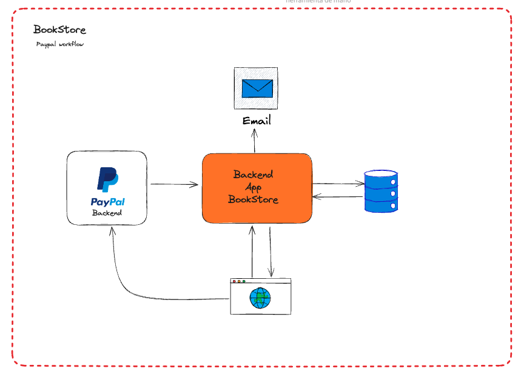

# **Integración de Spring Boot con PayPal y Buenas Prácticas**

## **Descripción del Taller**

En este taller interactivo, aprenderás paso a paso cómo integrar la plataforma de pagos PayPal en aplicaciones desarrolladas con Spring Boot. Abordaremos las técnicas necesarias para manejar pagos en línea de manera segura y eficiente, un requisito esencial para cualquier negocio digital. Adicionalmente, exploraremos cómo mejorar el rendimiento de tu aplicación mediante el uso de caching con Redis, cómo personalizar tu aplicación creando anotaciones con Spring Aspect-Oriented Programming (AOP), y cómo garantizar la calidad de tu software a través de pruebas efectivas en Spring. Estas habilidades son cruciales para construir aplicaciones comerciales robustas y escalables.

## **Tabla de Contenidos**

- **Introducción**: Explicaremos qué habilidades y conocimientos adquirirás en este taller.
- **Requisitos**: Listado de herramientas y conocimientos previos necesarios para participar.
- **Arquitectura Técnica**: Una visión general de los componentes de la aplicación y cómo interactúan.
- **Servicios Backend**: Detalle de los servicios que componen la solución y su función.
- **Flujo Típico de la Aplicación**: Seguimiento del proceso desde que el usuario navega en la aplicación hasta que se completa la entrega del producto.

## **Introducción**

En este taller, aprenderás a integrar PayPal con aplicaciones Spring Boot, implementar caching con Redis, crear anotaciones personalizadas con Spring AOP, y realizar pruebas efectivas. Estas habilidades son esenciales para desarrollar aplicaciones comerciales robustas y escalables.

## **Requisitos**

- **Java**: Versión 17 o superior.
- **Spring Boot**: Versión 2.5.x o superior.
- **Base de Datos**: PostgreSQL.
- **Redis**: Utilizado para implementar el caching y mejorar el rendimiento.
- **IDE (Entorno de Desarrollo Integrado)**: IntelliJ IDEA, Eclipse, o cualquier otro de tu preferencia.
- **Cuenta de PayPal Developer**: Necesaria para obtener las credenciales de desarrollo.
- **Herramientas de Construcción**: Maven o Gradle.
- **Docker**: Utilizado para la creación y gestión de contenedores, facilitando un entorno de desarrollo consistente y fácil de replicar.

## **Arquitectura Técnica y Servicios Backend**

### **Arquitectura Técnica:**

- **Backend App Bookstore**: Representa la aplicación central que maneja las interacciones de bookstore, incluidos la visualización de productos, la gestión del carrito de compras y el procesamiento de los pagos.
- **PayPal Backend**: Sistema externo que gestiona los procesos de autenticación y transacción para los pagos realizados a través de PayPal.
- **Email System**: Utilizado para enviar notificaciones y confirmaciones relacionadas con los pedidos y pagos a los clientes.
- **Database**: Almacena información relevante como detalles del usuario, información de productos, datos del carrito, y registros de transacciones.

### **Servicios Backend:**

- **Servicio de Catálogo**: Gestiona la información del producto, incluidas las descripciones, precios y disponibilidad.
- **Servicio de Pago**: Interfaz con PayPal para procesar transacciones de pago.
- **Servicio de Pedidos**: Administra la creación y el estado de los pedidos, asegurando que los detalles del pedido se guarden y actualicen correctamente.
- **Servicio de Notificaciones (Email)**: Envía correos electrónicos a los usuarios sobre el estado de su pedido y transacciones.

## **Flujo Típico de la Aplicación**

1. **Navegación del Catálogo**: El cliente explora los productos disponibles a través de la Backend App Bookstore.
2. **Selección y Carrito de Compras**: Añade productos preferidos a la cesta.
3. **Proceso de Pago**:
      * El cliente procede a la página de pago.
      * Introduce sus datos personales y de pago.
4. **Validación de Datos de Pago**:
      * Se verifica la validez de los datos de pago a través del Servicio de Pago que interactúa con el PayPal Backend.
      * Dependiendo del resultado de la validación, el estado del pedido se establece en "NUEVO" (si es válido) o en "ERROR" (si no lo es).
5. **Registro y Gestión de Pedidos**:
      * Los datos del pedido son almacenados en la base de datos.
      * Se publica un evento `OrderCreated` si el pago es exitoso; en caso contrario, se publica un evento `OrderError`.
6. **Notificación al Cliente**: El Servicio de Notificaciones envía un email al cliente confirmando el estado del pedido basado en los eventos `OrderCreated` o `OrderError`.

