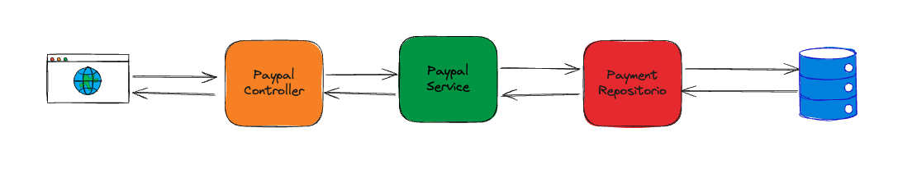

## Integración de PayPal



### Configuracion Inicial
Para comenzar con la integración de PayPal en tu proyecto de Spring Boot, sigue estos pasos:

1. **Crear una cuenta de desarrollador en PayPal:**
   - Visita [PayPal Developer](https://developer.paypal.com) y regístrate o inicia sesión.
   - Crea una nueva aplicación desde el dashboard para obtener las credenciales necesarias (Client ID y Secret).

2. **Configurar las credenciales en tu aplicación Spring Boot:**
   - Agrega las credenciales en tu archivo `application.properties` o `application.yml`:

```properties
paypal.client.id=YOUR_CLIENT_ID
paypal.client.secret=YOUR_CLIENT_SECRET
paypal.mode=sandbox
```

Configurar el APIContext de PayPal en Spring Boot:
```java
@Configuration
public class PayPalConfig {
    @Value("${paypal.client.id}")
    private String clientId;
    @Value("${paypal.client.secret}")
    private String clientSecret;
    @Value("${paypal.mode}")
    private String mode;

    @Bean
    public APIContext apiContext() {
        return new APIContext(clientId, clientSecret, mode);
    }
}
```

## Manejo de Transacciones
Implementa los servicios necesarios para manejar las transacciones con PayPal:

1) Servicio para crear pagos:
```java
@Service
public class PayPalService {
    @Autowired
    private APIContext apiContext;

    public Payment createPayment(Double total, String currency, String method, 
                                 String intent, String description, 
                                 String cancelUrl, String successUrl) throws PayPalRESTException {
        Amount amount = new Amount();
        amount.setCurrency(currency);
        amount.setTotal(String.format("%.2f", total));

        Transaction transaction = new Transaction();
        transaction.setDescription(description);
        transaction.setAmount(amount);

        List<Transaction> transactions = new ArrayList<>();
        transactions.add(transaction);

        Payer payer = new Payer();
        payer.setPaymentMethod(method.toString());

        Payment payment = new Payment();
        payment.setIntent(intent.toString());
        payment.setPayer(payer);
        payment.setTransactions(transactions);

        RedirectUrls redirectUrls = new RedirectUrls();
        redirectUrls.setCancelUrl(cancelUrl);
        redirectUrls.setReturnUrl(successUrl);
        payment.setRedirectUrls(redirectUrls);

        return payment.create(apiContext);
    }
}
```

2) Servicio para ejecutar pagos:

```java
@Service
public class PayPalService {
    @Autowired
    private APIContext apiContext;

    public Payment executePayment(String paymentId, String payerId) throws PayPalRESTException {
        Payment payment = new Payment();
        payment.setId(paymentId);
        PaymentExecution paymentExecute = new PaymentExecution();
        paymentExecute.setPayerId(payerId);
        return payment.execute(apiContext, paymentExecute);
    }
}
```

## Seguridad en los Pagos
Para asegurar las transacciones, considera validar las notificaciones de pago instantáneo (IPN) de PayPal y proteger los datos de los usuarios.

1.  Validar IPN:
    * Configura tu aplicación para recibir y validar mensajes IPN desde PayPal, asegurando la integridad de las transacciones.