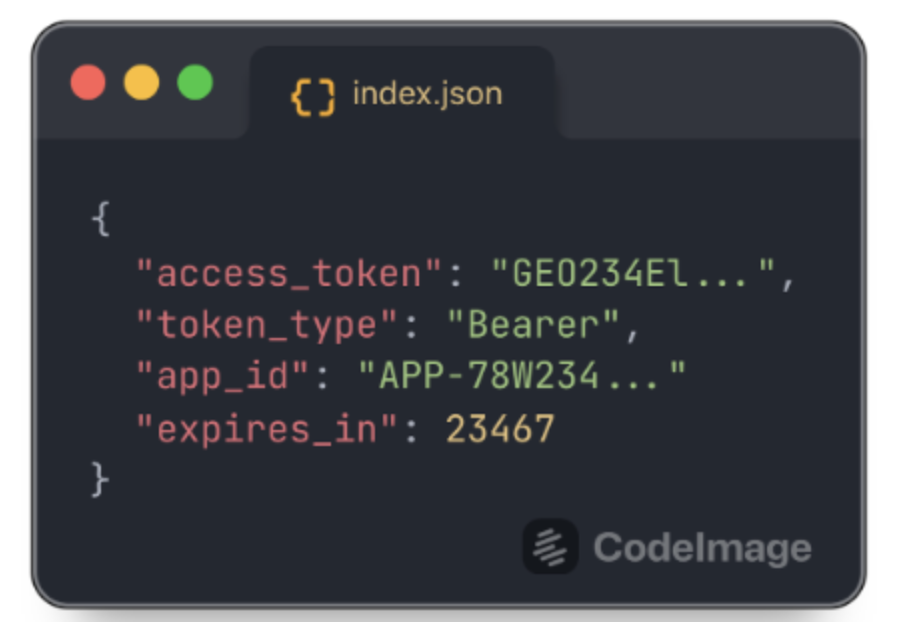

## **Diseño de PayPal**


### **Datos de las credenciales de PayPal App**
1. **Client ID:** ```Aa-dr-NstbDTv_lE7bGEH7eJRJdxo1CHmoiTUM5qX_F8XoXIHTn-26YuMiHTSVld5XwjPs0OUe7o67Z2```
2. **Secret Key:**
```EGFt988GJmVa4a_2BUEMXPZkygOJgY96dER0p_UxIc5UvCI-tVEnUbH-gSJ1t8NTkq7Rjklj6UbbF6gt```
3. **Sandbox URL:** ```https://api-m.sandbox.paypal.com```

### **Datos de la cuenta personal de pruebas PayPal:**

1. **Email:** ```geovanny-test@personal.example.com```
2. **Contraseña:** ```ow#)_R8w```

## **Guía de laboratorio 2: PayPal**

### **Creación De Venta**
1. Crear un servicio llamado SalesOrderService que se encargue de crear una venta a partir de una lista de ID's de libros.
2. Crear los siguientes endpoints en HomeController que permitan realizar las siguientes solicitudes HTTP.
    * POST /api/checkout/paypal/create
          * Descripción: Crea una orden de paypal y retorna el enlace de pago.
          * Body: lista de ids de libros a comprar
          * Query param: returnUrl -> una URL de retorno en caso suceda un éxito o error cuando se realice el pago con paypal.
          * Response: {"approveUrl": "el enlace de pago de paypal"}
    * POST /checkout/paypal/capture
          * Descripción: Consulta si el pago se ha realizado correctamente y devuelve su estado.
          * Query param: token -> el token que retorna paypal e identifica una orden de compra paypal.
          * Response: {"completed": "verdadero si el pago fue completado", "orderId": "el id de la venta"}
    * GET /orders/{orderId}/items/{itemId}/book/download
          * Descripción: Retorna el archivo PDF de un libro y disminuye el n° de descargas disponibles.
          * Variable: orderId -> id de la venta, itemId -> id del item de venta.
          * Response: el archivo como un Resource de Spring.


<p align="center"><strong>Figura #1</strong></p>


<p align="center"><strong>Figura #2</strong></p>


<p align="center"><strong>Figura #3</strong></p>

### **Crear los DTO's para paypal**
```java
public record TokenResponse(
    @JsonProperty("access_token") String accessToken,
    @JsonProperty("token_type") String tokenType,
    @JsonProperty("app_id") String appId,
    @JsonProperty("expires_in") Long expiresIn
) {}

public record ApplicationContext(
        @JsonProperty("brand_name") String brandName,
        @JsonProperty("return_url") String returnUrl,
        @JsonProperty("cancel_url") String cancelUrl
) { }

public record Amount(
        @JsonProperty("currency_code")
        CurrencyCode currencyCode,
        String value,
        Breakdown breakdown
) { }

public enum CurrencyCode {
    USD
}

@Getter
@Setter
@NoArgsConstructor
@Builder
@RequiredArgsConstructor
public class Breakdown {
    @NonNull
    @JsonProperty("item_total")
    private Amount itemTotal;
}

public record OrderItem(
        String name,
        String sku,
        String quantity,
        @JsonProperty("unit_amount") Amount unitAmount
) { }

public record PurchaseUnit(
        // Aquí enviaremos el ID de un objeto Order que representa una venta persistida en nuestra BD
        // y nos servirá para saber a qué venta corresponde el pago de paypal
        @JsonProperty("reference_id")
        String referenceId,
        Amount amount,
        List<OrderItem> items
) {
}

public record OrderRequest(
        @JsonProperty("application_context")
        ApplicationContext applicationContext,
        Intent intent,
        @JsonProperty("purchase_units")
        List<PurchaseUnit> purchaseUnits
) {}

public record Link(
        String href,
        String rel,
        String method
) {}

public record OrderResponse(
        String id,
        String status,
        List<Link> links
) {}

public record OrderCaptureResponse(
        String id,
        String status,
        @JsonProperty("purchase_units")
        List<PurchaseUnit> purchaseUnits
) { }
```

Adicionamos en el application.properties 

```properties
######## Paypal Configuration  #########
paypal.api.base=https://api-m.sandbox.paypal.com
paypal.client.id=Aa-dr-NstbDTv_lE7bGEH7eJRJdxo1CHmoiTUM5qX_F8XoXIHTn-26YuMiHTSVld5XwjPs0OUe7o67Z2
paypal.client.secret=EGFt988GJmVa4a_2BUEMXPZkygOJgY96dER0p_UxIc5UvCI-tVEnUbH-gSJ1t8NTkq7Rjklj6UbbF6gt
```

Crear un servicio llamado PaypalService con los siguientes atributos.
```java
    @Value("${paypal.api.base}")
    private  String paypalApiBase;
    @Value("${paypal.client.id}")
    private String paypalClientId;
    @Value("${paypal.client.secret}")
    private String paypalClientSecret;
```

Crear un método en el servicio que obtenga el access token de paypal.

```java title="PaypalService.java" linenums="1"

   public String getAccessToken() {
        String url = String.format("%s/v1/oauth2/token",paypalApiBase);
        RestTemplate restTemplate = new RestTemplate();

        HttpHeaders headers = new HttpHeaders();
        headers.setContentType(MediaType.APPLICATION_FORM_URLENCODED);
        headers.setBasicAuth(paypalClientId, paypalClientSecret);

        // FormHttpMessageConverter is configured by default
        MultiValueMap<String, String> form = new LinkedMultiValueMap<>();
        form.add("grant_type", "client_credentials");

        HttpEntity<MultiValueMap<String, String>> entity = new HttpEntity<>(form, headers);
        ResponseEntity<TokenResponse> response = restTemplate.postForEntity(url, entity, TokenResponse.class);

        return response.getBody().accessToken();
    }
```

Crear un método para crear la orden de compra en paypal.

```java title="PaypalService.java" linenums="1"
    public OrderResponse createOrder(SalesOrderEntity salesOrder, String returnUrl, String cancelUrl) {
        String url = String.format("%s/v2/checkout/orders", paypalApiBase);

        ApplicationContext applicationContext = new ApplicationContext("JCONF DOMINICANA", returnUrl, cancelUrl);

        List<OrderItem> orderItems = new ArrayList<>();
        salesOrder.getItems().forEach(salesItem -> {
            BookEntity book = salesItem.getBookEntity();
            Amount unitAmount = new Amount(CurrencyCode.USD, salesItem.getPrice().toString(), null);
            orderItems.add(new OrderItem(book.getName(), book.getId().toString(), "1", unitAmount));
        });

        Amount itemsAmount = new Amount(CurrencyCode.USD, salesOrder.getTotal().toString(), null);
        Amount purchaseAmount = new Amount(CurrencyCode.USD, salesOrder.getTotal().toString(), new Breakdown(itemsAmount));

        PurchaseUnit purchaseUnit = new PurchaseUnit(salesOrder.getId().toString(), purchaseAmount, orderItems);

        OrderRequest orderRequest = new OrderRequest(applicationContext, Intent.CAPTURE, Collections.singletonList(purchaseUnit));

        // get access token
        String accessToken = getAccessToken();

        // create http request
        HttpHeaders headers = new HttpHeaders();
        headers.setBearerAuth(accessToken);

        HttpEntity<OrderRequest> entity = new HttpEntity<>(orderRequest, headers);
        RestTemplate restTemplate = new RestTemplate();
        ResponseEntity<OrderResponse> response = restTemplate.postForEntity(url, entity, OrderResponse.class);

        return response.getBody();
    }
```

Crear un método para capturar la orden de compra (consultar el estado de pago) de paypal.

```java title="PaypalService.java" linenums="1"  
public OrderCaptureResponse captureOrder(String orderId) {
        String url = String.format("%s/v2/checkout/orders/%s/capture", paypalApiBase, orderId);

        // get access token
        String accessToken = getAccessToken();

        // create http request
        HttpHeaders headers = new HttpHeaders();
        headers.setBearerAuth(accessToken);
        headers.setContentType(MediaType.APPLICATION_JSON);

        try {
            HttpEntity<Object> entity = new HttpEntity<>(null, headers);
            RestTemplate restTemplate = new RestTemplate();
            ResponseEntity<OrderCaptureResponse> response = restTemplate.postForEntity(url, entity, OrderCaptureResponse.class);

            return response.getBody();
        } catch (HttpClientErrorException e) {
            return null;
        }
    }
```

Ahora implementamos el controlador

**Endpoint de crear order**

```java title="CheckoutController.java" linenums="1"
@PostMapping("/paypal/create")
    public Map<String, String> createPaypalCheckout(@RequestParam String returnUrl, @RequestBody CreateOrderRequest createOrderRequest) {
        SalesOrderEntity salesOrder = salesOrderService.createOrder(createOrderRequest.customerId(), createOrderRequest.bookIds());
        OrderResponse orderResponse = paypalService.createOrder(salesOrder, returnUrl, returnUrl);

        String approveUrl = orderResponse
                .links()
                .stream()
                .filter(link -> link.rel().equals("approve"))
                .findFirst()
                .orElseThrow(RuntimeException::new)
                .href();

        return Map.of("approveUrl", approveUrl);
    }
```

**Endpoint de Capture order**

```java title="CheckoutController.java" linenums="1"
    @PostMapping("/paypal/capture")
    public Map<String, Object> capturePaypalCheckout(@RequestParam String token) {
        OrderCaptureResponse orderCaptureResponse = paypalService.captureOrder(token);

        boolean completed = orderCaptureResponse != null && orderCaptureResponse.status().equals("COMPLETED");
        long orderId = 0;

        if (completed) {
            orderId = Long.parseLong(orderCaptureResponse.purchaseUnits().get(0).referenceId());
            salesOrderService.updatePaymentStatus(orderId, PaymentStatus.PAID);
        }
        return Map.of("completed", completed, "orderId", orderId);
    }
```

### **Conclusión**