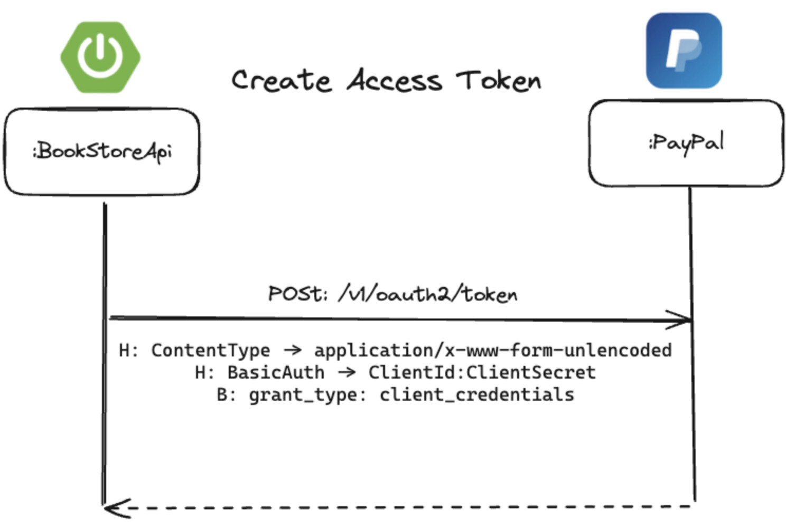
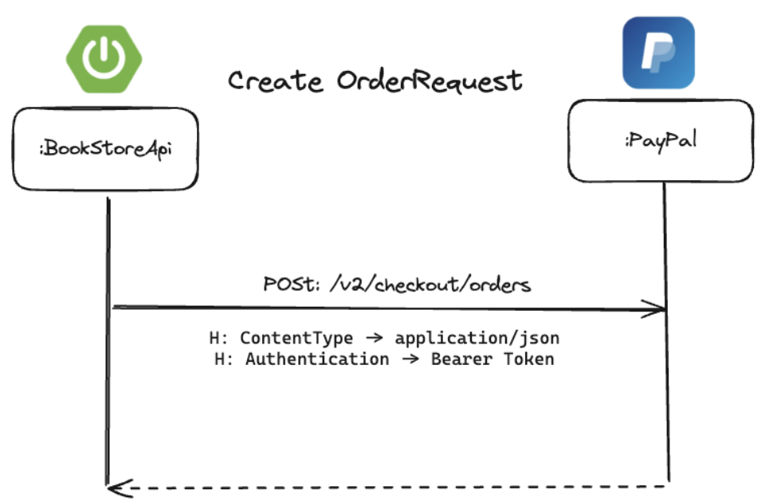

# **Integración con Paypal API**

## **Introducción a la Integración con PayPal API**

En esta sección, exploraremos cómo integrar la **API** de **PayPal** en una aplicación desarrollada con Spring Boot.

PayPal es uno de los proveedores de servicios de pago más populares y confiables a nivel mundial, ofreciendo una solución segura y fácil de usar para procesar pagos en línea.

El objetivo de esta integración es proporcionar una experiencia de pago fluida y segura para los usuarios de nuestra aplicación. A lo largo de esta guía, cubriremos los pasos necesarios para configurar y utilizar la API de PayPal, desde la creación de una orden de pago hasta la captura del pago final.

### **Beneficios de Integrar PayPal en tu Aplicación**

- **Seguridad**: PayPal maneja la seguridad y protección de los datos de pago del usuario.
- **Confiabilidad**: Con millones de usuarios en todo el mundo, PayPal es una plataforma probada y confiable para procesar pagos.
- **Facilidad de Uso**: La API de PayPal es fácil de integrar y proporciona una experiencia de usuario intuitiva y eficiente.
- **Compatibilidad Global**: Permite aceptar pagos de clientes en diferentes países y en múltiples monedas.

### **Diseño del Flujo de Pago**


El diagrama adjunto ilustra el flujo de pago completo utilizando PayPal, destacando las interacciones entre el cliente, el servidor y PayPal. A continuación, detallamos los pasos clave del proceso:

- **1. Inicio del Proceso de Pago**
    - **Cliente**: El usuario inicia el proceso de pago desde el cliente (por ejemplo, un navegador web).
    - **Acción**: El cliente envía una solicitud al servidor para iniciar el proceso de pago.
  
- **2. Creación de la Orden de Pago**
    - **Servidor**: El servidor recibe la solicitud de inicio de pago y procede a crear una orden de pago en PayPal.
    - **Acción**: El servidor envía una solicitud a la API de PayPal para crear una orden de pago.
    - **Encabezado (Header)**: H: Bearer Token - La solicitud incluye un token de autorización (Bearer Token) que autentica la solicitud en PayPal.
- **3. Respuesta de Creación de la Orden**
    - **PayPal**: PayPal recibe la solicitud de creación de la orden de pago y procesa la solicitud.
    - **Acción**: PayPal responde al servidor con los detalles de la orden creada, incluyendo una URL de redirección para la aprobación del pago por parte del usuario.
- **4. URL de Redirección hacia la Página de Aprobación de Pago**
    - **Servidor**: El servidor recibe la respuesta de PayPal y extrae la URL de redirección para la aprobación del pago.
    - **Acción**: El servidor envía esta URL de redirección al cliente.
- **5. Confirmación del Pago**
    - **Cliente**: El cliente recibe la URL de redirección y redirige al usuario a la página de aprobación de pago de PayPal.
    - **Acción**: El usuario revisa y confirma el pago en la página de PayPal.
- **6. Redirección a la Página de Éxito**
    - **PayPal**: Una vez que el usuario aprueba el pago, PayPal redirige al usuario de vuelta al servidor utilizando una URL de redirección proporcionada por el servidor.
    - **Acción**: PayPal incluye un token en la URL de redirección que permite al servidor identificar y verificar el pago.
- **7. Comprobación del Pago**
    - **Servidor**: El servidor recibe la redirección desde PayPal con el token incluido en la URL.
    - **Acción**: El servidor envía una solicitud a la API de PayPal para comprobar el estado del pago utilizando el token recibido.
    - **Parámetro (Query Parameter)**: ?Token - El token incluido en la URL permite verificar la transacción.
- **8. Captura del Pago**
    - **Servidor**: Si el pago es confirmado, el servidor procede a capturar el pago.
    - **Acción**: El servidor envía una solicitud a la API de PayPal para capturar el pago.
    - **Encabezado (Header)**: H: Bearer Token - La solicitud incluye un token de autorización (Bearer Token) que autentica la solicitud en PayPal.
- **9. Respuesta de Captura del Pago**
    - **PayPal**: PayPal procesa la captura del pago y envía una respuesta al servidor con los detalles de la transacción capturada.
    - **Acción**: PayPal confirma al servidor que el pago ha sido capturado exitosamente.
- **10. Respuesta Final**
    - **Servidor**: El servidor recibe la respuesta de captura del pago y procesa la información.
    - **Acción**: El servidor responde al cliente, indicando que el pago ha sido completado exitosamente.

### **Datos de las credenciales de PayPal App**

Para integrar PayPal en tu aplicación, necesitarás las credenciales de tu aplicación PayPal. Estas credenciales son necesarias para autenticar las solicitudes que tu servidor hará a la API de PayPal.

1. **Client ID:** Este es el identificador público de tu aplicación. Ejemplo: `Aa-dr-NstbDTv_lE7bGEH7eJRJdxo1CHmoiTUM5qX_F8XoXIHTn-26YuMiHTSVld5XwjPs0OUe7o67Z2`
2. **Secret Key:** Esta es la clave secreta de tu aplicación, usada para autenticar tus solicitudes junto con el Client ID. Ejemplo: `EGFt988GJmVa4a_2BUEMXPZkygOJgY96dER0p_UxIc5UvCI-tVEnUbH-gSJ1t8NTkq7Rjklj6UbbF6gt`
3. **Sandbox URL:** Utiliza esta URL para realizar pruebas con PayPal en el entorno sandbox. URL: `https://api-m.sandbox.paypal.com`

### **Datos de la cuenta personal de pruebas PayPal:**

Para realizar pruebas de integración, puedes utilizar una cuenta de pruebas en el entorno sandbox de PayPal. Aquí tienes un ejemplo de los datos de una cuenta de pruebas:

1. **Email:** `geovanny-test@personal.example.com`
2. **Contraseña:** `ow#)_R8w`

## **Guía de PayPal**

En esta sección, aprenderás a implementar la creación de ventas utilizando la API de PayPal. Esto incluye la creación de órdenes de pago, la captura de pagos y la gestión de descargas de archivos comprados.

### **Creación De Venta**

1. Crear un servicio llamado `SalesOrderService` que se encargue de crear una venta a partir de una lista de ID's de libros.
2. Crear los Endpoints en `OrderController`
   Define los endpoints que permitirán realizar solicitudes HTTP relacionadas con el proceso de compra y gestión de ventas.
    * **Endpoint 1**: Crear Orden de PayPal
          * **Descripción**: Crea una orden de paypal y retorna el enlace de pago.
          * **HTTP**: Method: `POST`
          * **URL**: `/api/checkout/paypal/create`
          * **Body**: lista de IDs de libros a comprar
          * **Query Param**: `returnUrl` - una URL de retorno en caso suceda un éxito o error cuando se realice el pago con paypal.
          * **Response**: `{"approveUrl": "el enlace de pago de paypal"}`
    * **Endpoint 2**: Capturar Pago de PayPal
         * **Descripción**: Consulta si el pago se ha realizado correctamente y devuelve su estado.
         * **HTTP Method**: `POST`
         * **URL**: `/checkout/paypal/capture`
         * **Query Param**: `token` - El token que retorna PayPal e identifica una orden de compra.
         * **Response**: `{"completed": "verdadero si el pago fue completado", "orderId": "el id de la venta"}`
    * **Endpoint 3**: Descargar Libro
         * **Descripción**: Retorna el archivo PDF de un libro y disminuye el número de descargas disponibles.
         * **HTTP Method**: `GET`
         * **URL**: `/orders/{orderId}/items/{itemId}/book/download`
         * **Variables**: orderId - ID de la venta, itemId - ID del ítem de venta.
         * **Response**: El archivo como un Resource de Spring.

### **1. Creación del Token de Acceso**


<p align="center"><strong>Figura #1</strong></p>

### **1.Solicitud de Token de Acceso**

- **Cliente (BookStoreApi)** envía una solicitud POST a la URL /v1/oauth2/token en PayPal.
- **Encabezados (Headers)**:
- **ContentType**: application/x-www-form-urlencoded
- **BasicAuth**: ClientId:ClientSecret
- **Cuerpo (Body)**:
    - **grant_type**: client_credentials
- **Respuesta de PayPal**
    - **PayPal** responde con un token de acceso.
    - El token de acceso tiene la siguiente estructura en JSON:


Este token de acceso se utilizará para autenticar todas las solicitudes posteriores a la API de PayPal.

### **2. Creación de la Orden de Pago**


<p align="center"><strong>Figura #2</strong></p>

### **1. Solicitud para Crear una Orden**

- **Cliente (BookStoreApi)** envía una solicitud POST a la URL /v2/checkout/orders en PayPal.
- **Encabezados (Headers)**:
    - **ContentType**: application/json
    - **Authentication**: Bearer Token
- **Cuerpo (Body)**:
Figura #2 
### **2. Respuesta de PayPal**

- PayPal responde con los detalles de la orden creada.
- La respuesta tiene la siguiente estructura en JSON:


El enlace con rel: "approve" es el que el cliente debe seguir para aprobar la orden de pago.

1. Captura de la Orden de Pago

<p align="center"><strong>Figura #3</strong></p>

### **1.Solicitud para Capturar la Orden**

- **Cliente (BookStoreApi)** envía una solicitud `POST` a la URL `/v2/checkout/orders/{orderId}/capture` en PayPal, donde `{orderId}` es el ID de la orden creada en el paso anterior.
- **Encabezados (Headers)**:
    - **`ContentType`**: `application/json`
    - **`Authentication`**: `Bearer Token`

### **2. Respuesta de PayPal**

- PayPal responde con los detalles de la orden capturada.
- La respuesta tiene la siguiente estructura en JSON:


**En Resumen**

1. **Creación del Token de Acceso**: Autenticar las solicitudes a la API de PayPal obteniendo un token de acceso.
2. **Creación de la Orden de Pago**: Crear una orden de pago en PayPal y obtener el enlace para que el cliente apruebe el pago.
3. **Captura de la Orden de Pago**: Capturar la orden de pago aprobada y confirmar la transacción.

### **Detalle de la Integración con PayPal**

En esta sección, explicaremos cómo integrar PayPal en una aplicación Spring Boot, detallando la creación de DTOs, el servicio de PayPal, y los controladores necesarios para manejar el flujo de pago. La conclusión resumirá todo lo que hemos hecho.

### **1. Crear los DTOs para PayPal**

Los DTOs (Data Transfer Objects) son necesarios para estructurar los datos que enviaremos y recibiremos desde la API de PayPal.

**TokenResponse**

```java title="TokenResponse.java" linenums="1"
public record TokenResponse(
    @JsonProperty("access_token") String accessToken,
    @JsonProperty("token_type") String tokenType,
    @JsonProperty("app_id") String appId,
    @JsonProperty("expires_in") Long expiresIn
) {}
```

- **TokenResponse**: Estructura de datos para manejar la respuesta del token de acceso de PayPal.

**ApplicationContext**

```java title="ApplicationContext.java" linenums="1"
public record ApplicationContext(
        @JsonProperty("brand_name") String brandName,
        @JsonProperty("return_url") String returnUrl,
        @JsonProperty("cancel_url") String cancelUrl
) { }
```

- **ApplicationContext**: Estructura de datos para manejar el contexto de la aplicación en PayPal.

**Amount y CurrencyCode**

```java title="Amount.java & CurrencyCode.java" linenums="1"
public record Amount(
        @JsonProperty("currency_code")
        CurrencyCode currencyCode,
        String value,
        Breakdown breakdown
) { }

public enum CurrencyCode {
    USD
}
```

- **Amount**: Estructura de datos para manejar el monto y la moneda de la transacción.
- **CurrencyCode**: Enum para manejar los códigos de moneda.

**Breakdown**

```java title="Breakdown.java" linenums="1"
@Getter
@Setter
@NoArgsConstructor
@Builder
@RequiredArgsConstructor
public class Breakdown {
    @NonNull
    @JsonProperty("item_total")
    private Amount itemTotal;
}
```

- **Breakdown**: Estructura de datos para manejar el desglose del monto de la transacción.

**OrderItem**

```java title="OrderItem.java" linenums="1"
public record OrderItem(
        String name,
        String sku,
        String quantity,
        @JsonProperty("unit_amount") Amount unitAmount
) { }
```

- **OrderItem**: Estructura de datos para manejar los ítems de la orden.

**PurchaseUnit**

```java title="PurchaseUnit.java" linenums="1"
public record PurchaseUnit(
        @JsonProperty("reference_id")
        String referenceId,
        Amount amount,
        List<OrderItem> items
) {
}
```

- **PurchaseUnit**: Estructura de datos para manejar las unidades de compra.

**OrderRequest, Intent y OrderResponse**

```java title="OrderRequest.java, OrderResponse.java & Intent.java" linenums="1"
public record OrderRequest(
        @JsonProperty("application_context")
        ApplicationContext applicationContext,
        Intent intent,
        @JsonProperty("purchase_units")
        List<PurchaseUnit> purchaseUnits
) {}

public record OrderResponse(
        String id,
        String status,
        List<Link> links
) {}

public enum Intent {
    CAPTURE
}
```

- **OrderRequest**: Estructura de datos para enviar la solicitud de creación de una orden.
- **OrderResponse**: Estructura de datos para manejar la respuesta de la creación de una orden.
- **Intent**: Define el propósito o la intención de una operación específica en nuestro sistema. En este caso, la única intención disponible es `CAPTURE`.
    - `CAPTURE`: Este valor indica que la operación tiene la intención de capturar una transacción, como un pago o una autorización en un sistema de procesamiento de pagos.

**Link y OrderCaptureResponse**

```java title="Link.java & OrderCaptureResponse.java" linenums="1"
public record Link(
        String href,
        String rel,
        String method
) {}

public record OrderCaptureResponse(
        String id,
        String status,
        @JsonProperty("purchase_units")
        List<PurchaseUnit> purchaseUnits
) { }
```

- **Link**: Estructura de datos para manejar los enlaces proporcionados por PayPal.
- **OrderCaptureResponse**: Estructura de datos para manejar la respuesta de captura de una orden.

### **2. Configuración en `application.properties`**

```properties title="application.properties" linenums="1"
######## Paypal Configuration  #########
paypal.api.base=https://api-m.sandbox.paypal.com
paypal.client.id=Aa-dr-NstbDTv_lE7bGEH7eJRJdxo1CHmoiTUM5qX_F8XoXIHTn-26YuMiHTSVld5XwjPs0OUe7o67Z2
paypal.client.secret=EGFt988GJmVa4a_2BUEMXPZkygOJgY96dER0p_UxIc5UvCI-tVEnUbH-gSJ1t8NTkq7Rjklj6UbbF6gt
```

- **paypal.api.base**: URL base de la API de PayPal.
- **paypal.client.id**: ID del cliente de PayPal.
- **paypal.client.secret**: Secreto del cliente de PayPal.

### **3. Crear un servicio llamado PaypalService con los siguientes atributos.**

- **Atributos del Servicio**

```java
    @Value("${paypal.api.base}")
    private  String paypalApiBase;
    @Value("${paypal.client.id}")
    private String paypalClientId;
    @Value("${paypal.client.secret}")
    private String paypalClientSecret;
```

Utilizamos la anotación `@Value` para inyectar las propiedades de configuración desde `application.properties`, incluyendo la URL base de la API de PayPal, el ID del cliente y el secreto del cliente.

### **4. Crear un método en el servicio que obtenga el access token de paypal**.

Este método `getAccessToken` construye la URL para obtener el token de acceso utilizando la URL base de la API de PayPal. Configura los encabezados HTTP para que el contenido sea `application/x-www-form-urlencoded` y añade autenticación básica con el ID y el secreto del cliente. Luego, construye un formulario HTTP con el tipo de concesión `client_credentials`. Finalmente, realiza una solicitud POST a PayPal y devuelve el token de acceso de la respuesta.

```java title="PaypalService.java" linenums="1"

   public String getAccessToken() {
        String url = String.format("%s/v1/oauth2/token",paypalApiBase);
        RestTemplate restTemplate = new RestTemplate();

        HttpHeaders headers = new HttpHeaders();
        headers.setContentType(MediaType.APPLICATION_FORM_URLENCODED);
        headers.setBasicAuth(paypalClientId, paypalClientSecret);

        // FormHttpMessageConverter is configured by default
        MultiValueMap<String, String> form = new LinkedMultiValueMap<>();
        form.add("grant_type", "client_credentials");

        HttpEntity<MultiValueMap<String, String>> entity = new HttpEntity<>(form, headers);
        ResponseEntity<TokenResponse> response = restTemplate.postForEntity(url, entity, TokenResponse.class);

        return response.getBody().accessToken();
    }
```

- **Línea 2:**
    - **Construcción de la URL:**

        ```java
        String url = String.format("%s/v1/oauth2/token", paypalApiBase);
        ```

    - Se construye la URL para la solicitud de token de acceso usando la URL base de la API de PayPal (`paypalApiBase`).

- **Línea 3:**
    - **Creación de RestTemplate:**

        ```java
        RestTemplate restTemplate = new RestTemplate();
        ```

    - Se crea una instancia de `RestTemplate` para realizar la solicitud HTTP.

- **Línea 4-7:**
    - **Configuración de los Encabezados HTTP:**

        ```java
        HttpHeaders headers = new HttpHeaders();
        headers.setContentType(MediaType.APPLICATION_FORM_URLENCODED);
        headers.setBasicAuth(paypalClientId, paypalClientSecret);
        ```

    - Se configuran los encabezados HTTP:
        - **`Content-Type`** se establece como `application/x-www-form-urlencoded`
        - **`BasicAuth`** se configura con el ID y el secreto del cliente PayPal para la autenticación básica.

- **Línea 10-11:**
    - **Creación del Cuerpo de la Solicitud:**

        ```java
        MultiValueMap<String, String> form = new LinkedMultiValueMap<>();
        form.add("grant_type", "client_credentials");
        ```

    - Se crea un `MultiValueMap` para el cuerpo de la solicitud.
    - `MultiValueMap` es una implementación de mapa que permite almacenar múltiples valores para una sola clave, útil cuando se necesita enviar datos en formato `application/x-www-form-urlencoded`.
    - En este caso, solo se añade un parámetro `grant_type` con el valor `client_credentials`. Esto indica que estamos solicitando un token de acceso utilizando las credenciales del cliente.

- **Línea 13:**
    - **Creación de la Entidad HTTP:**

        ```java
        HttpEntity<MultiValueMap<String, String>> entity = new HttpEntity<>(form, headers);
        ```

        - Se crea una instancia de `HttpEntity` que combina los encabezados y el cuerpo de la solicitud. `HttpEntity` es una clase de Spring que representa la entidad HTTP, la cual incluye los datos del formulario y los encabezados HTTP configurados anteriormente.
        - `HttpEntity<MultiValueMap<String, String>>` indica que la entidad contiene un cuerpo de tipo `MultiValueMap`, el cual es adecuado para enviar datos en formato `application/x-www-form-urlencoded`.

- **Línea 14:**
    - **Realización de la Solicitud POST:**

        ```java
        ResponseEntity<TokenResponse> response = restTemplate.postForEntity(url, entity, TokenResponse.class);
        ```

        - Se realiza una solicitud POST a PayPal utilizando `RestTemplate`, enviando la entidad HTTP y esperando una respuesta de tipo `TokenResponse`.

- **Línea 16:**
    - **Obtención y Retorno del Token de Acceso:**

        ```java
        return response.getBody().accessToken();
        ```

        - Se extrae y retorna el token de acceso desde el cuerpo de la respuesta.

Este método `getAccessToken` permite obtener un token de acceso de PayPal, necesario para autenticar las solicitudes subsecuentes a la API de PayPal.

### **5. Crear un método para crear la orden de compra en paypal.**

El método `createOrder` crea una orden en PayPal. Primero, construye la URL para la creación de la orden y configura el contexto de la aplicación con las URLs de retorno y cancelación. Luego, construye una lista de ítems de la orden a partir de los ítems de la orden de venta (`salesOrder`). Calcula el monto total de los ítems y crea la unidad de compra (`PurchaseUnit`). Construye la solicitud de orden (`OrderRequest`) y obtiene un token de acceso. Configura los encabezados HTTP con el token de acceso y realiza una solicitud POST a PayPal para crear la orden, devolviendo la respuesta de la orden.

```java title="PaypalService.java" linenums="1"
    public OrderResponse createOrder(SalesOrderEntity salesOrder, String returnUrl, String cancelUrl) {
        String url = String.format("%s/v2/checkout/orders", paypalApiBase);

        ApplicationContext applicationContext = new ApplicationContext("JCONF DOMINICANA", returnUrl, cancelUrl);

        List<OrderItem> orderItems = new ArrayList<>();
        salesOrder.getItems().forEach(salesItem -> {
            BookEntity book = salesItem.getBookEntity();
            Amount unitAmount = new Amount(CurrencyCode.USD, salesItem.getPrice().toString(), null);
            orderItems.add(new OrderItem(book.getName(), book.getId().toString(), "1", unitAmount));
        });

        Amount itemsAmount = new Amount(CurrencyCode.USD, salesOrder.getTotal().toString(), null);
        Amount purchaseAmount = new Amount(CurrencyCode.USD, salesOrder.getTotal().toString(), new Breakdown(itemsAmount));

        PurchaseUnit purchaseUnit = new PurchaseUnit(salesOrder.getId().toString(), purchaseAmount, orderItems);

        OrderRequest orderRequest = new OrderRequest(applicationContext, Intent.CAPTURE, Collections.singletonList(purchaseUnit));

        // get access token
        String accessToken = getAccessToken();

        // create http request
        HttpHeaders headers = new HttpHeaders();
        headers.setBearerAuth(accessToken);

        HttpEntity<OrderRequest> entity = new HttpEntity<>(orderRequest, headers);
        RestTemplate restTemplate = new RestTemplate();
        ResponseEntity<OrderResponse> response = restTemplate.postForEntity(url, entity, OrderResponse.class);

        return response.getBody();
    }
```

- **Línea 2:**
    - **Construcción de la URL::**

        ```java
        String url = String.format("%s/v2/checkout/orders", paypalApiBase);
        ```

        - Se construye la URL para crear una orden utilizando la URL base de la API de PayPal (`paypalApiBase`) y concatenando la ruta `/v2/checkout/orders`.

- **Línea 4:**
    - **Configuración del Contexto de la Aplicación:**
  
        ```java
        ApplicationContext applicationContext = new ApplicationContext("JCONF DOMINICANA", returnUrl, cancelUrl);
        ```

        - Se crea un `ApplicationContext` con el nombre de la marca, la URL de retorno y la URL de cancelación. Este contexto se utiliza para configurar la experiencia del usuario en PayPal.

- **Línea 6-11:**
    - **Creación de la Lista de Ítems de la Orden:**

        ```java
        List<OrderItem> orderItems = new ArrayList<>();
        salesOrder.getItems().forEach(salesItem -> {
            BookEntity book = salesItem.getBookEntity();
            Amount unitAmount = new Amount(CurrencyCode.USD, salesItem.getPrice().toString(), null);
            orderItems.add(new OrderItem(book.getName(), book.getId().toString(), "1", unitAmount));
        });
        ```

        - Se inicializa una lista vacía de `OrderItem`.
        - Para cada ítem en la orden de venta (`salesOrder`):
            - Se obtiene la entidad del libro asociado.
            - Se crea un objeto `Amount` para representar el precio del ítem en dólares estadounidenses.
            - Se crea un objeto `OrderItem` con el nombre del libro, el ID, la cantidad y el precio unitario, y se agrega a la lista de ítems.

- **Línea 13:**
    - **Creación del Monto Total de los Ítems:**

        ```java
        Amount itemsAmount = new Amount(CurrencyCode.USD, salesOrder.getTotal().toString(), null);
        ```

        - Se crea un objeto Amount para representar el monto total de los ítems en dólares estadounidenses.

- **Línea 14:**
    - **Creación del Monto Total de la Compra con Desglose:**

        ```java
        Amount purchaseAmount = new Amount(CurrencyCode.USD, salesOrder.getTotal().toString(), new Breakdown(itemsAmount));
        ```

        - Se crea un objeto Amount para representar el monto total de la compra, incluyendo un desglose que muestra el total de los ítems.

- **Línea 16:**
    - **Creación de la Unidad de Compra:**

        ```java
        PurchaseUnit purchaseUnit = new PurchaseUnit(salesOrder.getId().toString(), purchaseAmount, orderItems);
        ```

        - Se crea un `PurchaseUnit` con el `ID` de la orden de venta, el monto total de la compra y la lista de ítems.

- **Línea 18:**
    - **Creación de la Solicitud de Orden:**

        ```java
        OrderRequest orderRequest = new OrderRequest(applicationContext, Intent.CAPTURE, Collections.singletonList(purchaseUnit));
        ```

        - Se crea un `OrderRequest` con el contexto de la aplicación, la intención de captura de pagos y una lista que contiene la unidad de compra.

- **Línea 21:**
    - **Obtención del Token de Acceso:**

        ```java
        String accessToken = getAccessToken();
        ```

        - Se obtiene el token de acceso utilizando el método `getAccessToken`.

- **Línea 24-25:**
    - **Configuración de los Encabezados HTTP:**

        ```java
        HttpHeaders headers = new HttpHeaders();
        headers.setBearerAuth(accessToken);
        ```

    - Se configuran los encabezados `HTTP`, estableciendo la autenticación `Bearer` con el token de acceso.

- **Línea 27:**
    - **Creación de la Entidad HTTP:**

        ```java
        HttpEntity<OrderRequest> entity = new HttpEntity<>(orderRequest, headers);
        ```

        - Se crea una entidad HTTP (`HttpEntity`) que combina la solicitud de orden y los encabezados `HTTP`.

- **Línea 28-29:**
    - **Realización de la Solicitud POST:**
    
        ```java
        RestTemplate restTemplate = new RestTemplate();
        ResponseEntity<OrderResponse> response = restTemplate.postForEntity(url, entity, OrderResponse.class);
        ```

        - Se crea una instancia de `RestTemplate` para realizar la solicitud HTTP.
        - Se realiza una solicitud POST a PayPal, enviando la entidad HTTP y esperando una respuesta de tipo `OrderResponse`.

- **Línea 31:**
    - **Devolución de la Respuesta de la Orden:**

        ```java
        return response.getBody();
        ```

        - Se extrae y devuelve el cuerpo de la respuesta de la orden.

Este método `createOrder` permite crear una orden de pago en PayPal, configurando todos los detalles necesarios y realizando la solicitud correspondiente a la API de PayPal.

### **6. Crear un método para capturar la orden de compra (consultar el estado de pago) de paypal.**

El método `captureOrder` captura una orden en PayPal. Primero, construye la URL para capturar la orden y obtiene un token de acceso. Configura los encabezados HTTP con el token de acceso y establece el tipo de contenido como JSON. Realiza una solicitud POST a PayPal para capturar la orden y devuelve la respuesta de la captura de la orden. Si hay un error en la solicitud HTTP, maneja la excepción y devuelve `null`.

```java title="PaypalService.java" linenums="1"  
public OrderCaptureResponse captureOrder(String orderId) {
        String url = String.format("%s/v2/checkout/orders/%s/capture", paypalApiBase, orderId);

        // get access token
        String accessToken = getAccessToken();

        // create http request
        HttpHeaders headers = new HttpHeaders();
        headers.setBearerAuth(accessToken);
        headers.setContentType(MediaType.APPLICATION_JSON);

        try {
            HttpEntity<Object> entity = new HttpEntity<>(null, headers);
            RestTemplate restTemplate = new RestTemplate();
            ResponseEntity<OrderCaptureResponse> response = restTemplate.postForEntity(url, entity, OrderCaptureResponse.class);

            return response.getBody();
        } catch (HttpClientErrorException e) {
            return null;
        }
    }
```

- **Línea 2:**
    - **Construcción de la URL:**

        ```java
        String url = String.format("%s/v2/checkout/orders/%s/capture", paypalApiBase, orderId);
        ```

        - Se construye la URL para capturar una orden utilizando la URL base de la API de PayPal (`paypalApiBase`) y el ID de la orden (`orderId`). La URL resultante tendrá el formato `https://api.paypal.com/v2/checkout/orders/{orderId}/capture`.

- **Línea 5:**
    - **Obtención del Token de Acceso:**
        
        ```java
        String accessToken = getAccessToken();
        ```

        - Se obtiene el token de acceso utilizando el método `getAccessToken`. Este token es necesario para autenticar la solicitud a la API de PayPal.

- **Línea 8-10:**
    - **Configuración de los Encabezados HTTP:**
    
        ```java
        HttpHeaders headers = new HttpHeaders();
        headers.setBearerAuth(accessToken);
        headers.setContentType(MediaType.APPLICATION_JSON);
        ```

    - Se configuran los encabezados HTTP:**
        - `BearerAuth` se configura con el token de acceso obtenido anteriormente.
        - `Content-Type` se establece como application/json, ya que la API de PayPal espera recibir y devolver datos en formato JSON.

- **Línea 13:**
    - **Creación de la Entidad HTTP:**

        ```java
        HttpEntity<Object> entity = new HttpEntity<>(null, headers);
        ```

        - Se crea una instancia de `HttpEntity` que combina los encabezados HTTP configurados. El cuerpo de la solicitud es `null` ya que no se requiere enviar datos adicionales en el cuerpo de la solicitud de captura.

- **Línea 14-15:**
    - **Realización de la Solicitud POST:**

    ```java
    RestTemplate restTemplate = new RestTemplate();
    ResponseEntity<OrderCaptureResponse> response = restTemplate.postForEntity(url, entity, OrderCaptureResponse.class);
    ```

    - Se crea una instancia de `RestTemplate` para realizar la solicitud HTTP.
    - Se realiza una solicitud POST a la URL de captura de la orden en PayPal, enviando la entidad HTTP. Se espera una respuesta de tipo `OrderCaptureResponse`.

- **Línea 17-19:**
    - **Manejo de la Respuesta y Excepciones:**

        ```java
        return response.getBody();
        } catch (HttpClientErrorException e) {
            return null;
        }
        ```

        - Si la solicitud POST es exitosa, se devuelve el cuerpo de la respuesta (`response.getBody()`), que contiene los detalles de la captura de la orden.
        - Si ocurre una excepción de tipo `HttpClientErrorException` durante la solicitud, se captura la excepción y se retorna `null`. Este manejo básico de excepciones indica que la captura de la orden falló.

Este método `captureOrder` permite capturar una orden de pago en PayPal, realizando la solicitud correspondiente a la API de PayPal y manejando la respuesta o posibles errores de manera adecuada.

### **7. Implementación del Controlador**

El controlador `CheckoutController` maneja las solicitudes HTTP relacionadas con el proceso de pago de PayPal. Aquí se implementan dos endpoints: uno para crear la orden y otro para capturarla.

### **Endpoint de crear order**

 El método `createPaypalCheckout` crea una orden de venta utilizando el servicio `SalesOrderService` y luego crea una orden en PayPal utilizando el servicio `PaypalService`. La URL de aprobación devuelta por PayPal se extrae de la respuesta y se devuelve en un mapa.

```java title="CheckoutController.java" linenums="1"
@PostMapping("/paypal/create")
public Map<String, String> createPaypalCheckout(@RequestParam String returnUrl, @RequestBody CreateOrderRequest createOrderRequest) {
    SalesOrderEntity salesOrder = salesOrderService.createOrder(createOrderRequest.customerId(), createOrderRequest.bookIds());
    OrderResponse orderResponse = paypalService.createOrder(salesOrder, returnUrl, returnUrl);

    String approveUrl = orderResponse
            .links()
            .stream()
            .filter(link -> link.rel().equals("approve"))
            .findFirst()
            .orElseThrow(RuntimeException::new)
            .href();

    return Map.of("approveUrl", approveUrl);
}
```

- **Línea 1-2:**
    - **Definición del Método createPaypalCheckout:**

        ```java
        @PostMapping("/paypal/create")
        public Map<String, String> createPaypalCheckout(@RequestParam String returnUrl, @RequestBody CreateOrderRequest createOrderRequest) {
        ```

        - **`@PostMapping("/paypal/create")`**: Define el endpoint que maneja las solicitudes POST a ```/paypal/create```.
        - **`@RequestParam String returnUrl`**: Captura el parámetro de consulta `returnUrl` de la solicitud.
        - **`@RequestBody CreateOrderRequest createOrderRequest`**: Captura el cuerpo de la solicitud como un objeto CreateOrderRequest.

- **Línea 3:**
    - **Creación de la Orden de Venta:**

        ```java
        SalesOrderEntity salesOrder = salesOrderService.createOrder(createOrderRequest.customerId(), createOrderRequest.bookIds());
        ```

        - Se crea una orden de venta utilizando el servicio `SalesOrderService` con el ID del cliente y la lista de IDs de libros.

- **Línea 4:**
    - **Creación de la Orden en PayPal:**

        ```java
        OrderResponse orderResponse = paypalService.createOrder(salesOrder, returnUrl, returnUrl);
        ```

        - Se crea una orden en PayPal utilizando el servicio `PaypalService`, pasando la orden de venta y las URLs de retorno y cancelación.

- **Línea 6-12:**
    - **Extracción de la URL de Aprobación:**

        ```java
        String approveUrl = orderResponse
                .links()
                .stream()
                .filter(link -> link.rel().equals("approve"))
                .findFirst()
                .orElseThrow(RuntimeException::new)
                .href();
        ```

        - Se extrae la URL de aprobación de la respuesta de PayPal, filtrando los enlaces y buscando el que tiene la relación (`rel`) "approve".

- **Línea 14:**
    - **Devolución de la URL de Aprobación:**

        ```java
        return Map.of("approveUrl", approveUrl);
        ```
    
        - Se devuelve la URL de aprobación en un mapa.

### **Clase CreateOrderRequest**

La clase CreateOrderRequest es una representación de un objeto de transferencia de datos (DTO) utilizado para crear una nueva orden en el sistema. Esta clase encapsula la información necesaria para realizar la solicitud de creación de una orden, incluyendo el ID del cliente y una lista de IDs de libros.

### **Propiedades de CreateOrderRequest**

- **customerId**: Identificador único del cliente que realiza la orden. Este ID se utiliza para asociar la orden con un cliente específico en el sistema.
- **bookIds**: Lista de identificadores únicos de los libros que se incluyen en la orden. Esta lista contiene los IDs de los libros que el cliente desea comprar.

```java
public record CreateOrderRequest(Long customerId, List<Long> bookIds) {}
```

La clase `CreateOrderRequest` es importante porque:

- **Facilita la Transferencia de Datos**: Proporciona una estructura clara y concisa para transferir la información necesaria al crear una nueva orden en el sistema.
- **Asegura la Integridad de los Datos**: Al encapsular los datos requeridos para la creación de una orden, se asegura de que toda la información necesaria esté presente y correctamente estructurada.
- **Mejora la Legibilidad del Código**: Al utilizar un objeto de transferencia de datos (DTO), se mejora la legibilidad y mantenibilidad del código, ya que se define claramente qué datos son necesarios para la operación.

### **Endpoint de Capture order**

El método `capturePaypalCheckout` captura una orden de PayPal utilizando el servicio `PaypalService`. Verifica si la captura fue completada y, de ser así, actualiza el estado del pago en la base de datos utilizando el servicio `SalesOrderService`. Devuelve el estado de la captura y el ID de la orden en un mapa.

```java title="CheckoutController.java" linenums="1"
@PostMapping("/paypal/capture")
public Map<String, Object> capturePaypalCheckout(@RequestParam String token) {
    OrderCaptureResponse orderCaptureResponse = paypalService.captureOrder(token);

    boolean completed = orderCaptureResponse != null && orderCaptureResponse.status().equals("COMPLETED");
    long orderId = 0;

    if (completed) {
        orderId = Long.parseLong(orderCaptureResponse.purchaseUnits().get(0).referenceId());
        salesOrderService.updatePaymentStatus(orderId, PaymentStatus.PAID);
    }
    return Map.of("completed", completed, "orderId", orderId);
}
```

- **Línea 1-2:**
    - **Definición del Método capturePaypalCheckout:**

        ```java
        @PostMapping("/paypal/capture")
        public Map<String, Object> capturePaypalCheckout(@RequestParam String token) {
        ```

        - **`@PostMapping("/paypal/capture")`**: Define el endpoint que maneja las solicitudes POST a ```/paypal/capture```.
        - **```@RequestParam String token```**: Captura el parámetro de consulta token de la solicitud.

- **Línea 3:**
    - **Captura de la Orden en PayPal:**

        ```java
        OrderCaptureResponse orderCaptureResponse = paypalService.captureOrder(token);
        ```

        - Se captura la orden en PayPal utilizando el servicio ```PaypalService``` con el token de la orden.

- **Línea 5-6:**
    - **Verificación de la Captura:**

        ```java
        boolean completed = orderCaptureResponse != null && orderCaptureResponse.status().equals("COMPLETED");
        long orderId = 0;
        ```

        - Se verifica si la captura fue completada comprobando que la respuesta no sea ```null``` y que el estado de la orden sea **"COMPLETED"**.

- **Línea 8-11:**
    - **Actualización del Estado del Pago:**

        ```java
        if (completed) {
            orderId = Long.parseLong(orderCaptureResponse.purchaseUnits().get(0).referenceId());
            salesOrderService.updatePaymentStatus(orderId, PaymentStatus.PAID);
        }
        ```

        - Si la captura fue completada, se obtiene el ID de la orden y se actualiza el estado del pago en la base de datos utilizando el servicio ```SalesOrderService```.

- **Línea 12:**
    - **Devolución del Estado de la Captura y el ID de la Orden:**

        ```java
        return Map.of("completed", completed, "orderId", orderId);
        ```

        - Se devuelve el estado de la captura y el ID de la orden en un mapa.

Este controlador ```CheckoutController``` permite manejar el flujo de creación y captura de órdenes de PayPal, integrando servicios para gestionar las órdenes y actualizando el estado de los pagos en la base de datos.

### **Conclusión**

En esta sesión, hemos detallado el proceso de integración de PayPal en una aplicación Spring Boot. Empezamos creando los DTOs necesarios para manejar las solicitudes y respuestas de la API de PayPal. Configuramos las propiedades de la aplicación para incluir las credenciales y la URL base de PayPal. Luego, implementamos el servicio PaypalService con métodos para obtener el token de acceso, crear órdenes y capturar órdenes. Finalmente, implementamos el controlador CheckoutController con endpoints para crear y capturar órdenes de PayPal. Este flujo permite manejar pagos de forma eficiente y segura en una aplicación Spring Boot.